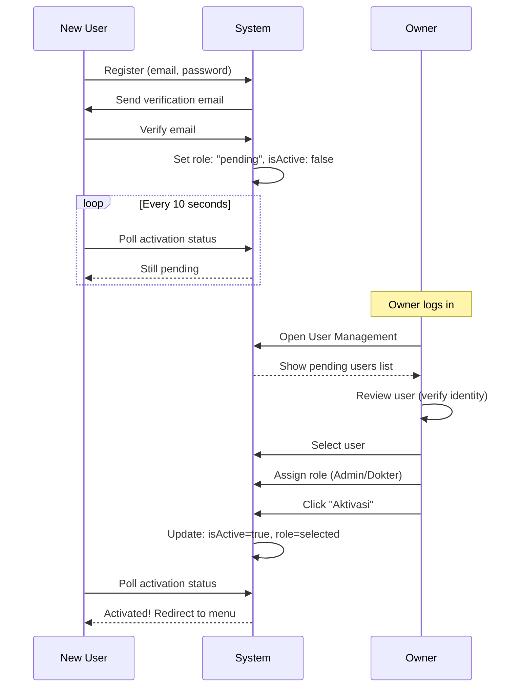
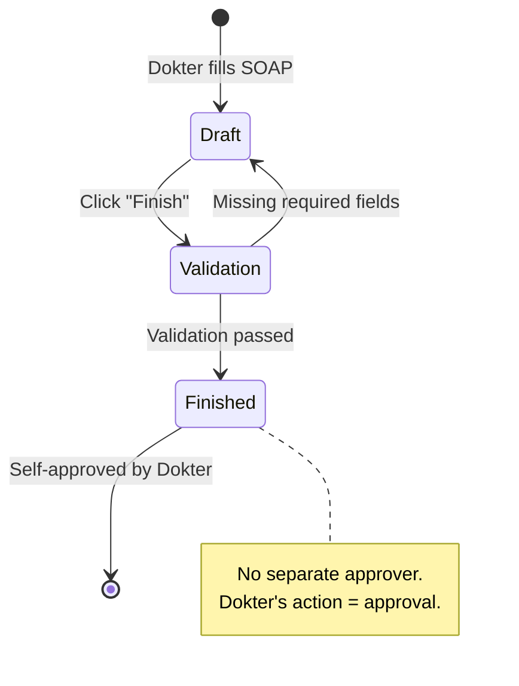
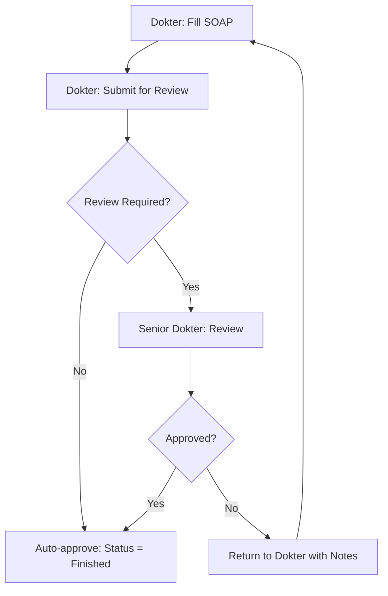
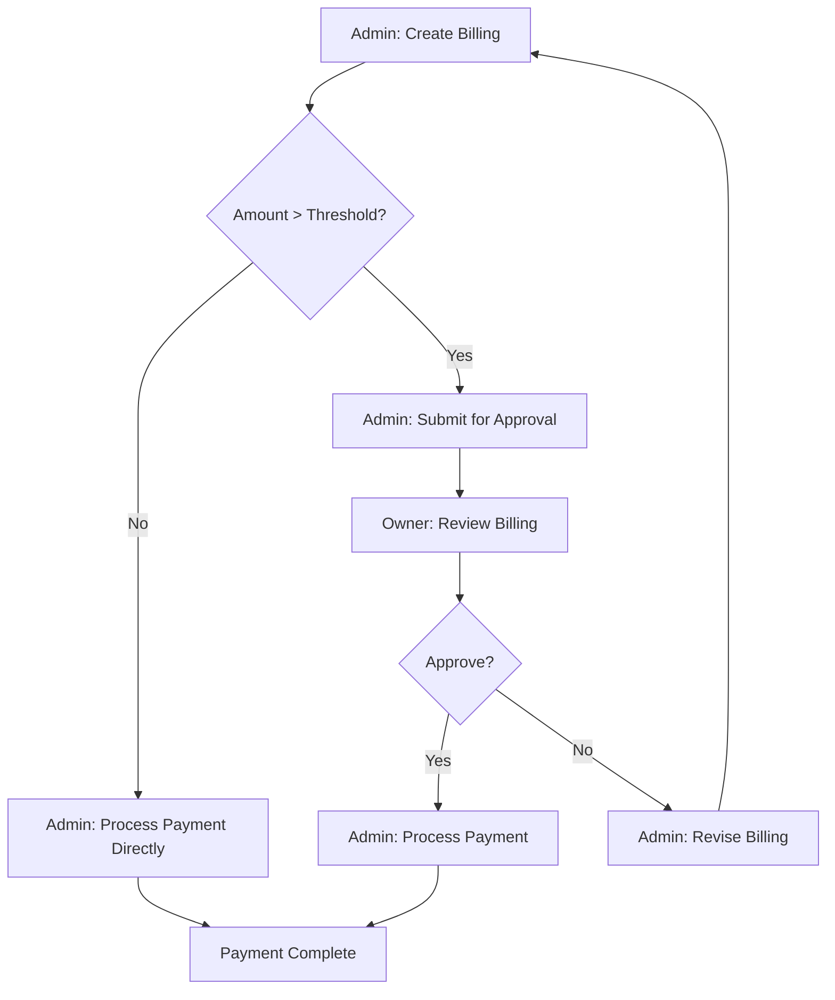
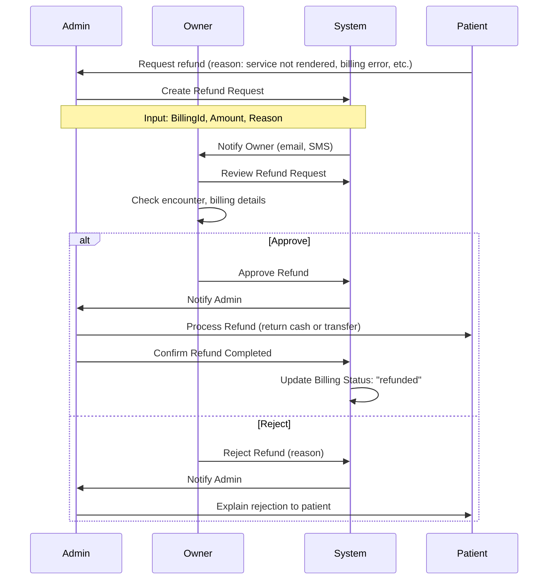
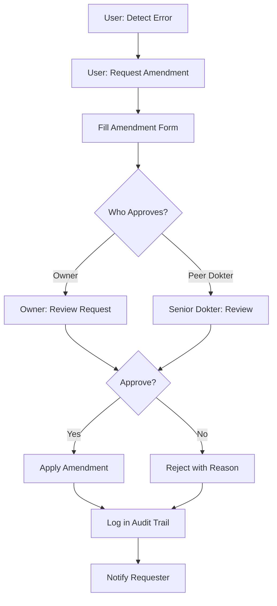

# APPROVAL WORKFLOW & NOTIFICATION REQUIREMENT
# ApexRecord - Sistem Manajemen Klinik Kesehatan

**Versi:** 1.0  
**Tanggal:** 10 Juni 2026

---

## TABLE OF CONTENTS

1. [Overview](#1-overview)
2. [User Activation Workflow](#2-user-activation-workflow)
3. [Clinical Documentation Approval](#3-clinical-documentation-approval)
4. [Financial Transaction Approval](#4-financial-transaction-approval)
5. [Data Correction Workflow](#5-data-correction-workflow)
6. [Notification Requirements](#6-notification-requirements)
7. [Escalation Rules](#7-escalation-rules)
8. [Audit Trail](#8-audit-trail)
9. [Gap Analysis - Approval Workflows](#9-gap-analysis---approval-workflows)

---

## 1. OVERVIEW

### 1.1 Approval Concept in ApexRecord

**Current State:**  
Berdasarkan analisis source code, sistem ApexRecord **tidak memiliki formal approval workflow** untuk sebagian besar transaksi. Sistem lebih mengandalkan **role-based access control** dan **status-based workflow**.

**Approval-Like Mechanisms yang Ada:**
1. **User Activation by Owner** - Satu-satunya explicit approval process
2. **Encounter Status Progression** - Implicitly approved by status changes
3. **Payment Confirmation** - Admin confirms payment, tidak perlu approval
4. **SATUSEHAT Sync** - Automatic, no human approval

### 1.2 Approval Levels (Current Implementation)

| Process | Initiator | Approver | Approval Type | Implementation Status |
|---------|-----------|----------|---------------|----------------------|
| **User Registration → Activation** | New User | Owner | Explicit | ✅ Implemented |
| **Patient Registration** | Admin | System (Auto-validate) | Automatic | ✅ Implemented |
| **Encounter Creation** | Admin/Dokter | System (Validation) | Automatic | ✅ Implemented |
| **Clinical Documentation** | Dokter | Dokter (Self-approve by marking finished) | Self-approval | ✅ Implemented |
| **Billing Creation** | Admin | Admin (Self-approve) | Self-approval | ✅ Implemented |
| **Payment Processing** | Admin | Admin (Self-approve) | Self-approval | ✅ Implemented |
| **Prescription** | Dokter | Dokter (Self-approve) | Self-approval | ✅ Implemented |
| **Medication Dispensing** | Admin | Admin (Self-approve) | Self-approval | ✅ Implemented |
| **Stock Adjustment** | Admin | Owner (Review via report) | Post-approval | ⚠️ Partial |
| **Refund/Cancellation** | Admin | Owner | Explicit | ❌ Not Implemented |
| **Data Correction (Critical Fields)** | Any User | Owner | Explicit | ❌ Not Implemented |

### 1.3 Approval Philosophy

**Current Design:**
- **Trust-based:** System assumes users act with integrity
- **Role-segregation:** Different roles handle different stages (e.g., Dokter documents, Admin bills)
- **Post-audit:** Owner reviews via reports, not pre-approve
- **Status-driven:** Status changes act as implicit approvals

**Pros:**
- ✅ Fast workflow, no bottlenecks
- ✅ Users empowered to work independently
- ✅ Suitable for small clinics (5-10 staff)

**Cons:**
- ❌ Risk of errors or fraud (low detection until audit)
- ❌ No oversight for critical actions (refunds, deletions)
- ❌ Difficult to trace accountability without audit logs

---

## 2. USER ACTIVATION WORKFLOW

### 2.1 Process Overview

**This is the ONLY explicit approval workflow currently implemented.**



### 2.2 Approval Levels

| Level | Role | Action | Authority |
|-------|------|--------|-----------|
| **Level 0** | System | Auto-validation (email, password strength) | Automatic |
| **Level 1** | Owner | Assign role and activate | Required |

**No multi-level approval:** Owner decision is final.

### 2.3 Approval Criteria

**Owner должен verify:**
1. **Identity Verification:**
   - Check KTP/ID card
   - Confirm via phone call or interview
   - Verify user adalah staff klinik yang sah

2. **Role Assignment:**
   - Admin: For front desk, cashier
   - Dokter: Must be registered practitioner (NIK verified)

3. **Practitioner Linkage (for Dokter):**
   - Dokter must be linked to practitionerId
   - Practitioner must be registered in SATUSEHAT

### 2.4 Rejection Process

**Current Implementation:** ⚠️ **No explicit rejection feature**

**What Owner Can Do:**
- Simply not activate the user (user stays in pending indefinitely)
- ❌ Cannot send rejection notification to user
- ❌ Cannot delete pending user (⚠️ unclear if possible)

**Recommended Enhancement:**
- Add "Reject" button
- Input rejection reason
- Send email notification to user
- Remove user from pending list
- Log rejection in audit trail

### 2.5 Escalation Rules

**N/A** - Owner is highest authority, no escalation needed for user activation.

**Edge Case:** If Owner unavailable and urgent user activation needed:
- ⚠️ No backup mechanism
- **Recommendation:** Allow secondary Owner or emergency access procedure

### 2.6 Notification

**Current State:**
- ❌ No email notification to user when activated
- ✅ User detects activation via polling (every 10 sec)

**User Experience:**
1. User waits on "Accept Pending" page
2. Page auto-polls Firestore every 10 seconds
3. When isActive becomes true, page redirects to menu
4. User sees success message (⚠️ unclear if implemented)

**Recommended Enhancement:**
- Email notification: "Your account has been activated as [Role]"
- SMS notification (optional)
- Push notification (if mobile app)

---

## 3. CLINICAL DOCUMENTATION APPROVAL

### 3.1 Current State: Self-Approval by Dokter

**Process:**
1. Dokter fills SOAP tabs (Anamnesis, Vital Signs, Diagnosis, etc.)
2. Dokter clicks "Finish Encounter"
3. System validates required fields
4. If validation passes:
   - Status: finished
   - Encounter locked (read-only)
   - SATUSEHAT sync triggered
5. **No separate approval step**



### 3.2 Quality Control Mechanism

**Current Implementation:**
- ✅ Required field validation (Keluhan Utama, Vital Signs, Diagnosis)
- ✅ Status prevents editing after finished
- ⚠️ **No peer review or supervisor approval**

**Quality Assurance Happens Post-Facto:**
- Owner can review finished encounters via reports
- Owner can see SOAP completeness metrics
- If error found: Owner must "Reopen" encounter (⚠️ not clear if implemented)

### 3.3 Proposed Enhancement: Optional Peer Review

**For teaching clinics or quality assurance:**



**Configuration:**
- Owner sets: "Require peer review for junior doctors"
- Or: "Random sampling: 10% encounters reviewed"

**Benefits:**
- Quality assurance
- Teaching opportunity
- Early error detection

**Implementation Effort:** Medium (requires new workflow and UI)

---

## 4. FINANCIAL TRANSACTION APPROVAL

### 4.1 Billing & Payment (Current State)

**No approval workflow - Admin self-approves.**

**Process:**
1. Admin creates billing (add items, discounts)
2. Admin saves billing → Status: "unpaid"
3. Admin processes payment → Status: "paid"
4. **No separate approver**

**Control Mechanisms:**
- ✅ Discount limited to max allowed per tarif
- ✅ All transactions logged with userId and timestamp
- ⚠️ **No real-time oversight**

### 4.2 Risk Analysis

**Fraud Scenarios:**

| Risk | Current Control | Residual Risk | Mitigation |
|------|-----------------|---------------|------------|
| **Admin creates fake billing** | Billing tied to encounter | Low (encounter traceable to patient) | ✅ Adequate |
| **Admin applies excessive discount** | Max discount limit enforced | Low | ✅ Adequate |
| **Admin pockets cash payment** | All payments logged | **High** (no real-time verification) | ⚠️ Needs improvement |
| **Admin refunds without justification** | No refund workflow | **High** (refund not implemented, so risk is 0 but also capability is 0) | ⚠️ Need refund workflow with approval |

### 4.3 Proposed Enhancement: Dual Control for High-Value Transactions

**Concept:** Transactions above threshold require Owner approval.



**Configuration:**
- Owner sets threshold (e.g., >Rp 1.000.000 requires approval)
- Approval via mobile push notification (fast approval)

**Benefits:**
- Fraud prevention
- High-value transaction oversight
- Owner awareness of large billings

**Implementation Effort:** Medium

---

### 4.4 Refund Approval Workflow (Proposed)

**Current State:** ❌ No refund feature implemented

**Proposed Process:**



**Approval Criteria:**
- ✅ Service not rendered (encounter cancelled)
- ✅ Billing error (overcharge, wrong service)
- ✅ Patient complaint (goodwill refund)
- ❌ Patient changed mind after service rendered (case-by-case)

**Business Rules:**
- BR-REFUND-001: Refunds >50% of billing require Owner approval
- BR-REFUND-002: Refunds must be processed within 7 days
- BR-REFUND-003: Refund reason must be documented
- BR-REFUND-004: Refunded billings cannot be re-opened

**Implementation Effort:** Medium-High

---

## 5. DATA CORRECTION WORKFLOW

### 5.1 Current State: Open Edit Access

**For most data:**
- Admin can edit patient demographics freely
- Dokter can edit own clinical notes (before encounter finished)
- **No approval for corrections**

**Risks:**
- Accidental or malicious data alteration
- Audit trail incomplete (⚠️ Firestore logs changes but no UI for review)
- Compliance issue (medical records should be immutable after finalization)

### 5.2 Critical Fields Requiring Approval (Proposed)

**Fields that should NOT be freely editable:**

| Field | Entity | Current State | Proposed Workflow |
|-------|--------|---------------|-------------------|
| **NIK** | Patient | ⚠️ Editable by Admin | Lock after creation, require Owner approval to change |
| **No. RM** | Patient | ⚠️ Editable by Admin | Immutable, only Owner can change via special process |
| **Birth Date** | Patient | ⚠️ Editable by Admin | Require Owner approval (impacts age calculations) |
| **Diagnosis (ICD-10)** | Condition | ⚠️ Editable by Dokter | Lock after encounter finished, require peer review to amend |
| **Procedure Code** | Procedure | ⚠️ Editable by Dokter | Lock after encounter finished, require Owner approval (impacts billing) |
| **Billing Amount** | Billing | ⚠️ Editable by Admin | Lock after payment, require Owner approval for amendment |

### 5.3 Proposed Amendment Workflow

**For Critical Fields After Finalization:**



**Amendment Form:**
- Field to amend
- Old value
- New value
- Reason for amendment
- Supporting documents (optional)

**Approval Criteria:**
- Valid reason (human error, patient correction, new information)
- Supporting evidence (if available)
- No pattern of frequent amendments (flag suspicious activity)

**Business Rules:**
- BR-AMEND-001: Critical fields locked after finalization
- BR-AMEND-002: Amendment requires approval
- BR-AMEND-003: All amendments logged with before/after values
- BR-AMEND-004: Frequent amendments trigger review

**Implementation Effort:** High

---

## 6. NOTIFICATION REQUIREMENTS

### 6.1 Current Notification Mechanisms

**Implemented:**
1. **Email Verification** (Firebase Auth)
   - Sent on: User registration
   - Recipient: New user
   - Trigger: Automatic

2. **Polling-Based Status Update** (Not true notification)
   - Used for: User activation status
   - Method: Frontend polls Firestore every 10 sec
   - ⚠️ Not push notification, not scalable

**Not Implemented:**
- ❌ Email notifications for business events
- ❌ SMS notifications
- ❌ WhatsApp notifications
- ❌ Push notifications (mobile app)
- ❌ In-app notifications (bell icon)

### 6.2 Notification Requirements by Event

#### **6.2.1 User Management Notifications**

| Event | Trigger | Recipient | Channel | Priority | Status |
|-------|---------|-----------|---------|----------|--------|
| **New User Registered** | User completes registration | Owner | Email | High | ❌ Not Implemented |
| **User Activated** | Owner activates user | User | Email, SMS | High | ⚠️ Partial (polling only) |
| **User Deactivated** | Owner deactivates user | User | Email | Medium | ❌ Not Implemented |
| **Password Reset Requested** | User requests reset | User | Email | Critical | ✅ Firebase handles |

**Proposed Email Template: User Activated**
```
Subject: Akun ApexRecord Anda Telah Diaktivasi

Dear [Name],

Selamat! Akun Anda di ApexRecord [Clinic Name] telah diaktivasi oleh Owner.

Role: [Admin/Dokter]
Email Login: [email]

Silakan login di: [URL]

Jika Anda memiliki pertanyaan, hubungi admin klinik.

Terima kasih,
Tim ApexRecord
```

---

#### **6.2.2 Patient & Appointment Notifications**

| Event | Trigger | Recipient | Channel | Priority | Status |
|-------|---------|-----------|---------|----------|--------|
| **Online Booking Confirmed** | Patient submits booking | Patient | SMS, WhatsApp | High | ❌ Not Implemented |
| **Appointment Reminder (H-1)** | 24 hours before appointment | Patient | SMS, WhatsApp | High | ❌ Not Implemented |
| **Queue Number Called** | Admin calls queue | Patient | SMS, Display | Critical | ⚠️ Display only |
| **Appointment Cancelled** | Admin/Patient cancels | Patient/Admin | SMS | Medium | ❌ Not Implemented |
| **Doctor Schedule Changed** | Admin updates schedule | Affected Patients | SMS, WhatsApp | High | ❌ Not Implemented |

**Proposed SMS Template: Booking Confirmed**
```
[Clinic Name]
Booking konfirmasi:
No Antrian: [XX]
Tanggal: [DD/MM/YYYY]
Jam: [HH:MM]
Dokter: [Dr. Name]
Token: [XXXXXXXX]

Cek status: [URL]
Datang 15 menit lebih awal.
```

**Proposed SMS Template: Appointment Reminder**
```
[Clinic Name]
Pengingat: Anda memiliki janji temu besok.
Tanggal: [DD/MM/YYYY]
Jam: [HH:MM]
Dokter: [Dr. Name]

Jika berhalangan, hubungi: [Phone]
```

---

#### **6.2.3 Clinical Workflow Notifications**

| Event | Trigger | Recipient | Channel | Priority | Status |
|-------|---------|-----------|---------|----------|--------|
| **New Encounter Assigned** | Admin creates encounter | Dokter | In-app | Medium | ❌ Not Implemented |
| **Prescription Ready** | Dokter writes prescription | Admin (Pharmacy) | In-app | High | ❌ Not Implemented |
| **Lab Results Available** | External lab uploads result | Dokter, Patient | Email | Medium | ❌ Not Implemented |
| **SATUSEHAT Sync Failed** | Sync error occurs | Owner | Email (daily digest) | Low | ❌ Not Implemented |

---

#### **6.2.4 Financial Notifications**

| Event | Trigger | Recipient | Channel | Priority | Status |
|-------|---------|-----------|---------|----------|--------|
| **Invoice Generated** | Admin creates billing | Patient | Email, WhatsApp | Medium | ❌ Not Implemented |
| **Payment Received** | Admin processes payment | Patient | SMS (receipt confirmation) | Low | ❌ Not Implemented |
| **Payment Overdue** | Receivable >30 days | Patient, Owner | SMS, Email | High | ❌ Not Implemented |
| **Daily Cashier Report** | End of day (auto) | Owner | Email | Medium | ❌ Not Implemented |
| **High-Value Transaction** | Billing >threshold | Owner | SMS, Email | High | ❌ Not Implemented |

**Proposed Email Template: Invoice**
```
Subject: Invoice Kunjungan - [Patient Name]

Dear [Patient Name],

Terima kasih atas kunjungan Anda di [Clinic Name].

Invoice #: [INV-XXXXX]
Tanggal: [DD/MM/YYYY]
Total Tagihan: Rp [X.XXX.XXX]
Status: [Lunas/Belum Lunas]

Detail invoice terlampir (PDF).

[Jika belum lunas:]
Pembayaran dapat dilakukan via:
- Cash di klinik
- Transfer: BCA 1234567890 a/n [Clinic Name]

Terima kasih,
[Clinic Name]
[Phone]
```

---

#### **6.2.5 Inventory Notifications**

| Event | Trigger | Recipient | Channel | Priority | Status |
|-------|---------|-----------|---------|----------|--------|
| **Low Stock Alert** | Quantity ≤ minStock | Admin, Owner | Email (daily digest) | Medium | ❌ Not Implemented |
| **Stock Out** | Quantity = 0 | Admin, Owner | SMS, Email | High | ❌ Not Implemented |
| **Expiration Warning (30 days)** | expirationDate - now ≤ 30 | Admin, Owner | Email (weekly) | Medium | ❌ Not Implemented |
| **Expiration Critical (7 days)** | expirationDate - now ≤ 7 | Admin, Owner | SMS, Email | High | ❌ Not Implemented |

---

### 6.3 Notification Channels

#### **6.3.1 Email**

**Use Cases:**
- User activation/deactivation
- Invoice delivery
- Daily/weekly reports
- Password reset

**Implementation:**
- Service: Firebase Cloud Functions + SendGrid/SMTP
- Template engine: Handlebars or EJS
- Tracking: Open rate, click rate (optional)

**Configuration:**
- Owner sets SMTP credentials in settings
- Or use SendGrid API key

---

#### **6.3.2 SMS**

**Use Cases:**
- Appointment confirmation
- Appointment reminder
- Queue called notification
- High-priority alerts

**Implementation:**
- Service: Twilio, Vonage, or local SMS gateway (Indonesia: Zenziva, Raja SMS)
- Cost: ~Rp 200-500 per SMS

**Configuration:**
- Owner sets SMS provider credentials
- Owner allocates SMS budget

---

#### **6.3.3 WhatsApp**

**Use Cases:**
- Appointment confirmation (richer content)
- Invoice with PDF attachment
- Lab result notification

**Implementation:**
- Service: Twilio WhatsApp API or WhatsApp Business API
- Requires: WhatsApp Business Account verification

**Benefits:**
- Higher open rate than SMS
- Support rich media (images, PDFs)
- Free for clinic (patient pays data)

---

#### **6.3.4 In-App Notification**

**Use Cases:**
- Real-time alerts for staff
- New encounter assigned to Dokter
- Prescription ready for Admin

**Implementation:**
- Firestore real-time listeners
- Notification center UI (bell icon)
- Badge count for unread

**Features:**
- Mark as read
- Click to navigate to relevant screen
- Notification history (last 30 days)

---

#### **6.3.5 Push Notification (Mobile App)**

**Use Cases:**
- Same as in-app, but works when app is closed
- Critical alerts (e.g., emergency patient)

**Implementation:**
- Firebase Cloud Messaging (FCM)
- Requires native mobile app (Flutter)

---

### 6.4 Notification Preferences

**Proposed Feature:** User can configure which notifications to receive.

**Settings UI:**
```
Notification Preferences

Email Notifications:
☑ Account activation
☑ Daily reports
☐ Invoice delivery (for patients)

SMS Notifications:
☑ Appointment reminders
☐ Queue called
☐ High-priority alerts

In-App Notifications:
☑ New encounter assigned
☑ Prescription ready
☑ SATUSEHAT sync errors

Digest Mode:
⚪ Real-time (default)
⚪ Hourly digest
⚪ Daily digest (9:00 AM)
```

**Implementation Effort:** Medium

---

## 7. ESCALATION RULES

### 7.1 Current State: No Formal Escalation

**Observation:**
- No timeout-based escalation (e.g., "if not approved in 24h, escalate to senior")
- No escalation hierarchy (e.g., Admin → Owner → External Auditor)
- Manual escalation via communication (phone, WhatsApp)

### 7.2 Proposed Escalation Matrix

#### **7.2.1 User Activation Escalation**

| Condition | Action | Escalation To | Timeframe |
|-----------|--------|---------------|-----------|
| Pending user >7 days | Auto-reminder email to Owner | Owner | Daily |
| Pending user >14 days | Flag in Owner dashboard | Owner | - |
| Pending user >30 days | Auto-reject OR notify secondary Owner | Secondary Owner | - |

---

#### **7.2.2 Financial Transaction Escalation**

| Condition | Action | Escalation To | Timeframe |
|-----------|--------|---------------|-----------|
| Receivable >30 days | Payment reminder to Patient | Patient | Weekly |
| Receivable >60 days | Owner notification for review | Owner | - |
| Receivable >90 days | Flag for debt collection or write-off | Owner | - |
| High-value billing pending approval >24h | Reminder to Owner | Owner | Daily |

---

#### **7.2.3 Clinical Quality Escalation**

| Condition | Action | Escalation To | Timeframe |
|-----------|--------|---------------|-----------|
| Encounter in-progress >4 hours | Reminder to Dokter | Dokter | Auto |
| Encounter in-progress >8 hours | Flag to Owner (potential abandoned case) | Owner | Auto |
| SATUSEHAT sync failed >3 retries | Owner notification | Owner | Immediate |
| SATUSEHAT sync failed >24 hours | Compliance risk alert | Owner | Immediate |

---

#### **7.2.4 Inventory Escalation**

| Condition | Action | Escalation To | Timeframe |
|-----------|--------|---------------|-----------|
| Stock ≤ minStock | Low stock alert | Admin | Daily digest |
| Stock = 0 | Critical alert | Admin, Owner | Immediate |
| Stock out >7 days | Procurement review | Owner | Weekly |
| Expiration <7 days | Critical expiration alert | Admin, Owner | Daily |

---

### 7.3 Escalation Notification Templates

**Example: User Pending >7 Days**
```
Subject: [Action Required] User Pending Activation - [User Name]

Dear [Owner Name],

User [User Name] ([email]) has been pending activation for 7 days.

Registered on: [Date]

Please review and activate or reject this user:
[Link to User Management]

If you have questions, contact support.

ApexRecord System
```

---

## 8. AUDIT TRAIL

### 8.1 Current Audit Capability

**What's Logged (Firebase Automatic):**
- ✅ All Firestore document writes (who, when, what changed)
- ✅ Authentication events (login, logout)
- ✅ Cloud Function invocations (logs)

**What's NOT Easily Accessible:**
- ❌ No UI for Owner to view audit logs
- ❌ No search/filter in audit logs
- ❌ No export audit logs for compliance
- ❌ No alerting on suspicious patterns

### 8.2 Proposed Audit Log UI (Owner-Only)

**Features:**
1. **Audit Log Viewer:**
   - Table: Date, Time, User, Action, Entity, Before, After
   - Filters: User, Date Range, Action Type, Entity Type
   - Search: Free text search
   - Export: CSV, PDF

2. **Critical Actions Dashboard:**
   - User activations/deactivations
   - Payment transactions >threshold
   - Data amendments
   - Failed login attempts
   - SATUSEHAT sync failures

3. **Suspicious Activity Alerts:**
   - Multiple failed logins (brute force attempt)
   - Unusual billing patterns (e.g., same patient billed 5× in one day)
   - Large discounts applied frequently by one Admin
   - Data corrections on critical fields

**Implementation Effort:** Medium-High

### 8.3 Audit Trail Requirements for Compliance

**Medical Record Regulations (Indonesia):**
- All changes to medical records must be traceable
- Audit logs retained for minimum 5 years
- Access logs (who viewed what patient record) may be required

**Financial Regulations:**
- Transaction logs retained for minimum 7 years (tax audit)
- All payment/refund actions must be traceable

**Current Gap:**
- ⚠️ Firestore provides logs, but not in compliance-ready format
- ⚠️ No formal data retention policy implemented
- ⚠️ No export function for audit logs

**Recommendations:**
1. Implement dedicated `auditLogs` collection
2. Log all critical actions explicitly:
   ```javascript
   function logAudit(action, entity, entityId, beforeData, afterData, userId) {
     auditLogs.add({
       action,        // "create", "update", "delete", "view"
       entity,        // "patient", "encounter", "billing", etc.
       entityId,
       before: beforeData,
       after: afterData,
       userId,
       userName,
       timestamp: now(),
       ipAddress,     // optional
     });
   }
   ```
3. Retention policy: Auto-archive logs older than 1 year, retain total 7 years
4. Export function for compliance audits

---

## 9. GAP ANALYSIS - APPROVAL WORKFLOWS

### 9.1 Summary of Gaps

| Process | Current State | Gap | Priority | Impact | Effort |
|---------|---------------|-----|----------|--------|--------|
| **User Activation** | Owner approves | ✅ Adequate | - | - | - |
| **Clinical Documentation Approval** | Self-approval by Dokter | ⚠️ No peer review for quality | Low | Medium (quality risk) | Medium |
| **Financial Transaction Approval** | Self-approval by Admin | ⚠️ No oversight for fraud risk | **High** | High (fraud risk) | Medium |
| **Refund Approval** | Not implemented | ❌ No refund workflow | **High** | High (compliance) | High |
| **Data Amendment Approval** | Open edit | ❌ No approval for critical fields | Medium | High (compliance) | High |
| **Email/SMS Notifications** | Not implemented | ❌ No automated notifications | **High** | High (UX, efficiency) | Medium |
| **Escalation Rules** | Manual | ⚠️ No automated escalation | Low | Medium | Low |
| **Audit Log UI** | No UI | ⚠️ Logs exist but not accessible | Medium | Medium (compliance) | Medium |

### 9.2 Recommendations by Priority

#### **High Priority (Implement in 3-6 Months)**

1. **Refund Approval Workflow**
   - **Why:** Currently no way to handle refunds, potential compliance issue
   - **Benefit:** Fraud prevention, proper financial controls
   - **Effort:** High (new workflow, UI, notifications)

2. **Automated Notifications (SMS/Email)**
   - **Why:** Manual communication is inefficient, error-prone
   - **Benefit:** Better patient experience, reduced admin workload
   - **Focus:** Appointment confirmation, reminder, queue called
   - **Effort:** Medium (integration with SMS provider)

3. **High-Value Transaction Alert (Threshold-Based)**
   - **Why:** Owner awareness of large billings
   - **Benefit:** Fraud prevention, oversight
   - **Effort:** Low (simple rule + notification)

#### **Medium Priority (Implement in 6-12 Months)**

4. **Data Amendment Approval Workflow**
   - **Why:** Critical fields should be immutable after finalization
   - **Benefit:** Data integrity, compliance
   - **Effort:** High (requires amendment request UI and approval workflow)

5. **Audit Log Viewer UI**
   - **Why:** Owner needs visibility into system activities
   - **Benefit:** Compliance, fraud detection
   - **Effort:** Medium (read-only UI with filters)

6. **Clinical Documentation Peer Review (Optional)**
   - **Why:** Quality assurance for teaching clinics
   - **Benefit:** Quality improvement
   - **Effort:** Medium (opt-in feature)

#### **Low Priority (Future Enhancement)**

7. **Automated Escalation Rules**
   - **Why:** Nice-to-have, not critical for small clinics
   - **Benefit:** Efficiency for larger operations
   - **Effort:** Low (timer-based rules + notifications)

8. **In-App Notification Center**
   - **Why:** Currently no real-time staff notifications
   - **Benefit:** Improved staff coordination
   - **Effort:** Medium (UI component + Firestore listeners)

---

### 9.3 Implementation Roadmap

**Phase 1: Foundational (Month 1-3)**
- Implement SMS/Email notification infrastructure
- Build audit log collection (backend)
- Add high-value transaction alerts

**Phase 2: Workflow Enhancement (Month 4-6)**
- Build refund approval workflow (full CRUD)
- Implement appointment notifications (confirmation, reminder)
- Build queue called notification (SMS)

**Phase 3: Governance (Month 7-9)**
- Build audit log viewer UI for Owner
- Implement data amendment approval workflow
- Add escalation rules for receivables

**Phase 4: Advanced (Month 10-12)**
- Clinical documentation peer review (opt-in)
- In-app notification center
- Advanced analytics on audit logs

---

## 10. CONCLUSION

### 10.1 Key Findings

1. **Minimal Formal Approval:** ApexRecord currently relies on role-based access control and status-driven workflows rather than explicit approval chains. This is suitable for small clinics but poses risks as clinics scale.

2. **Notification Gap:** No automated notifications via SMS/Email is a significant UX and efficiency gap. Patients and staff rely on manual communication.

3. **Audit Visibility:** Logs exist (Firebase) but not accessible to Owner for oversight. This is a compliance risk.

4. **Refund Workflow:** Critical gap - no way to handle refunds properly, which is a financial control issue.

### 10.2 Strategic Recommendation

**For small clinics (≤10 staff):**
- Current trust-based model is acceptable
- **Focus:** Implement notifications first (highest ROI)
- **Then:** Add high-value transaction alerts

**For growing clinics (>10 staff):**
- **Must:** Implement refund approval workflow
- **Must:** Build audit log viewer
- **Consider:** Data amendment approval for critical fields

**For teaching hospitals/quality-focused clinics:**
- **Consider:** Clinical documentation peer review workflow
- **Consider:** Advanced analytics on clinical data completeness

---

**END OF DOCUMENT**

This document provides a comprehensive analysis of approval workflows and notification requirements, based on current implementation and proposed enhancements.
