# BUSINESS PROCESS DOCUMENTATION
# ApexRecord - Sistem Manajemen Klinik Kesehatan

**Versi:** 1.0  
**Tanggal:** 10 Juni 2026

---

## TABLE OF CONTENTS

1. [Process Overview](#1-process-overview)
2. [Patient Registration Process](#2-patient-registration-process)
3. [Queue Management Process](#3-queue-management-process)
4. [Clinical Documentation Process](#4-clinical-documentation-process)
5. [Billing & Payment Process](#5-billing--payment-process)
6. [Pharmacy Dispensing Process](#6-pharmacy-dispensing-process)
7. [SATUSEHAT Integration Process](#7-satusehat-integration-process)
8. [User Management Process](#8-user-management-process)
9. [Status Transitions](#9-status-transitions)
10. [Exception Handling](#10-exception-handling)

---

## 1. PROCESS OVERVIEW

### 1.1 End-to-End Patient Journey

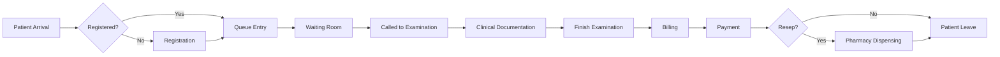

### 1.2 Key Process Metrics

| Process | Actor | Avg Duration | Critical Success Factor |
|---------|-------|--------------|-------------------------|
| **Patient Registration** | Admin | 5 minutes | NIK validation success |
| **Queue Creation** | Admin | 2 minutes | Slot availability |
| **Waiting Time** | Patient | 15-30 minutes | Queue management efficiency |
| **Clinical Examination** | Dokter | 15-20 minutes | Complete SOAP documentation |
| **Billing** | Admin | 3-5 minutes | Accurate charge entry |
| **Payment Processing** | Admin | 2-3 minutes | Payment method availability |
| **Medication Dispensing** | Admin/Pharmacist | 3-5 minutes | Stock availability |
| **SATUSEHAT Sync** | System | 1-5 seconds per resource | API availability |

**Total Journey Time:** 45-75 minutes (registration to exit)

---

## 2. PATIENT REGISTRATION PROCESS

### 2.1 Current Process (AS-IS)

#### **2.1.1 Process Flow**

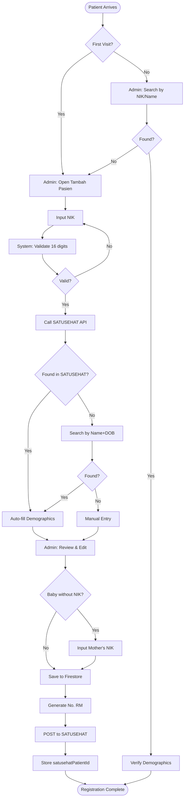

#### **2.1.2 Actor Responsibilities**

| Step | Actor | Action | System Response |
|------|-------|--------|-----------------|
| 1 | **Patient** | Datang ke front desk | - |
| 2 | **Admin** | Tanya apakah pasien lama/baru | - |
| 3a | **Admin** | Jika lama: Search by NIK atau nama | System displays matching patients |
| 3b | **Admin** | Jika baru: Klik "Tambah Pasien" | System opens registration form |
| 4 | **Admin** | Input NIK pasien | System validates format (16 digits) |
| 5 | **System** | Call `/searchPatient?nik={nik}` | Returns FHIR Patient resource or 404 |
| 6a | **System** | If found: Map data to form | Auto-fill: nama, tanggal lahir, gender, alamat |
| 6b | **System** | If not found: Fallback search by name+DOB | Admin inputs name and birthdate |
| 7 | **Admin** | Review auto-filled data, edit if needed | - |
| 8 | **Admin** | Input: phone, email (optional) | - |
| 9 | **Admin** | Klik "Simpan" | System validates required fields |
| 10 | **System** | Call Cloud Function `createPatient` | - |
| 11 | **System** | Generate No. RM (transaction lock for sequence) | Format: 000001, 000002, ... |
| 12 | **System** | Check duplicate by satusehatPatientId + clinicId | If exists: update, else: create |
| 13 | **System** | POST to SATUSEHAT `/Patient` | Returns IHS number & SATUSEHAT ID |
| 14 | **System** | Save to Firestore `patients/{patientId}` | Document created |
| 15 | **System** | Return success to UI | Admin sees success message + No. RM |

#### **2.1.3 Business Rules**

**BR-PR-001: NIK Validation**
- **Rule:** NIK must be exactly 16 digits, numeric only
- **Exception:** Baby tanpa NIK menggunakan NIK ibu dengan flag `nikIbu`
- **Validation:** Client-side (instant feedback) + Server-side (security)

**BR-PR-002: No. RM Generation**
- **Rule:** Sequential 6-digit number per clinic
- **Format:** Zero-padded (e.g., "000001", "000042", "001234")
- **Uniqueness:** Enforced by Firestore transaction
- **Scope:** Per `clinicId` (each clinic has own sequence)

**BR-PR-003: Duplicate Prevention**
- **Rule:** One patient = One record per clinic
- **Check:** By `satusehatPatientId` + `clinicId`
- **Action:** If duplicate found, UPDATE existing record instead of creating new
- **Note:** Pasien bisa terdaftar di multiple clinics dengan No. RM berbeda

**BR-PR-004: SATUSEHAT Sync**
- **Rule:** Every new patient MUST sync to SATUSEHAT
- **Timing:** Real-time on save
- **Failure Handling:** If sync fails, patient still saved locally with `syncStatus: failed`
- **Retry:** Admin can manually retry sync from patient detail page

**BR-PR-005: Required Fields**
- Mandatory: NIK (or nikIbu), name, birthDate, gender
- Optional: phone, email, address, city, postalCode
- Baby-specific: multipleBirth (birth order for twins)

**BR-PR-006: Data Source Priority**
1. SATUSEHAT (authoritative source)
2. Admin manual input (if not found in SATUSEHAT)
3. Update local if SATUSEHAT data changes

#### **2.1.4 Inputs & Outputs**

**Inputs:**
- NIK (16 digits)
- Name (string)
- Birth Date (YYYY-MM-DD)
- Gender (male/female)
- Phone (optional, 10-13 digits)
- Email (optional, valid format)
- Address, City, Postal Code (optional)
- Mother's NIK (for babies)
- Birth Order (for multiple birth)

**Outputs:**
- Patient record in Firestore
- No. RM (Medical Record Number)
- SATUSEHAT Patient ID (IHS Number)
- Sync status (synced/failed)

#### **2.1.5 Exception Scenarios**

**E-PR-001: NIK Tidak Valid (Format)**
- **Scenario:** Admin input NIK kurang/lebih dari 16 digit
- **Handling:** 
  - Client shows validation error: "NIK harus 16 digit"
  - Cannot proceed to save
  - Prompt Admin untuk cek ulang

**E-PR-002: NIK Tidak Ditemukan di SATUSEHAT**
- **Scenario:** NIK valid format tetapi tidak ada di database nasional
- **Possible Causes:**
  - NIK palsu/salah
  - Pasien belum terdaftar di SATUSEHAT
  - Error koneksi API
- **Handling:**
  1. System fallback ke search by Name + Birth Date
  2. Jika masih tidak ketemu, allow manual entry
  3. POST ke SATUSEHAT tetap dilakukan (registrasi baru)
  4. Jika POST gagal, save local dengan sync failed

**E-PR-003: Duplikat NIK**
- **Scenario:** NIK sudah terdaftar di klinik yang sama
- **Handling:**
  - System detect by satusehatPatientId + clinicId
  - Show dialog: "Pasien sudah terdaftar dengan No. RM XXX"
  - Option: "Lihat Data" (redirect ke patient detail)
  - Option: "Update Data" (allow edit existing)

**E-PR-004: SATUSEHAT API Down**
- **Scenario:** SATUSEHAT server tidak respond
- **Handling:**
  - Local save tetap proceed
  - Set `syncStatus: pending`
  - Show warning: "Data tersimpan lokal, akan sync otomatis saat koneksi pulih"
  - Retry job scheduled (setiap 1 jam)

**E-PR-005: Baby Tanpa NIK**
- **Scenario:** Bayi baru lahir belum punya NIK
- **Handling:**
  - Checkbox "Bayi tanpa NIK"
  - Input field berubah ke "NIK Ibu"
  - Flag `isNewborn: true` di data
  - Birth order input muncul (jika kembar)

---

### 2.2 Future Process (TO-BE) - Recommendations

#### **Proposed Enhancements:**

**1. Biometric Verification**
- Integrasi dengan fingerprint scanner untuk prevent fraud
- Cross-check NIK dengan biometric database Dukcapil

**2. Patient Self-Registration (Kiosk)**
- Patient input sendiri via tablet/kiosk di lobby
- Auto-scan KTP menggunakan OCR
- Admin hanya verify dan approve

**3. SMS/WhatsApp Notification**
- Setelah registrasi, kirim SMS dengan No. RM dan link cek antrian
- Reminder appointment via WA

**4. Integration with Health Insurance**
- Auto-check BPJS eligibility real-time
- Display coverage info to Admin

---

## 3. QUEUE MANAGEMENT PROCESS

### 3.1 Online Booking Process (Patient-Initiated)

#### **3.1.1 Process Flow**

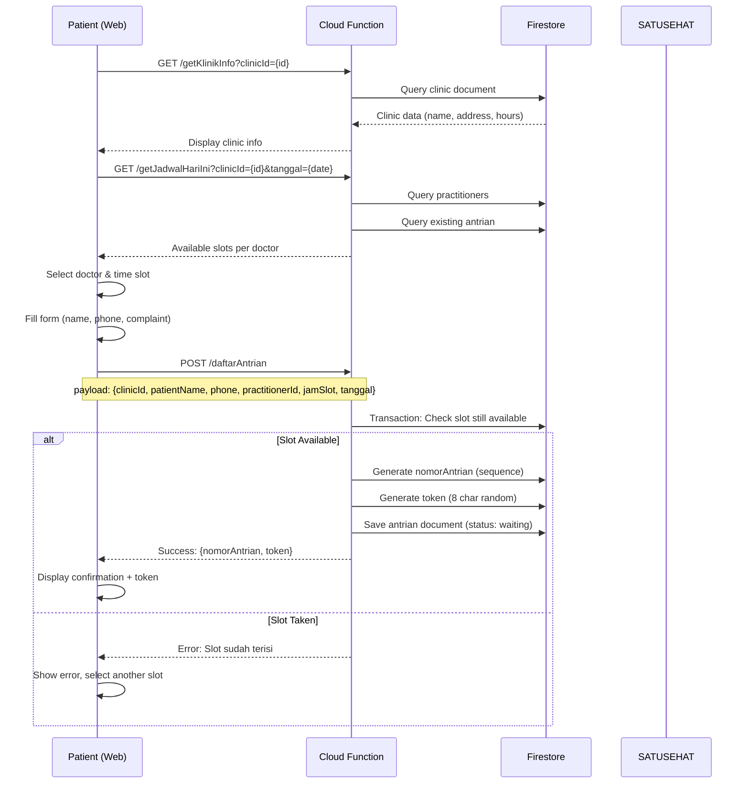

#### **3.1.2 Slot Generation Logic**

**Inputs:**
- Doctor's schedule: `jamBuka` (e.g., "08:00"), `jamTutup` (e.g., "17:00")
- Slot duration: 30 minutes (hardcoded)
- Existing bookings for the date

**Algorithm:**
```javascript
function generateSlots(jamBuka, jamTutup, existingBookings) {
  slots = [];
  currentTime = parseTime(jamBuka);
  endTime = parseTime(jamTutup);
  
  while (currentTime < endTime) {
    slot = formatTime(currentTime); // "08:00", "08:30", etc.
    isBooked = existingBookings.includes(slot);
    
    slots.push({
      time: slot,
      available: !isBooked
    });
    
    currentTime += 30 minutes;
  }
  
  return slots;
}
```

**Business Rules:**
- **BR-QM-001:** One slot = One patient per doctor
- **BR-QM-002:** Slots generated in 30-minute intervals
- **BR-QM-003:** Booking allowed up to 7 days in advance *(assumed - not explicit in code)*
- **BR-QM-004:** Booking closes 1 hour before appointment time *(assumed)*

#### **3.1.3 Queue Number Generation**

**Format:** Sequential number per clinic per day
- **Example:** 1, 2, 3, ..., 50

**Logic:**
```javascript
async function generateQueueNumber(clinicId, tanggal) {
  // Query highest number for this clinic on this date
  const maxNumber = await getMaxQueueNumber(clinicId, tanggal);
  return maxNumber + 1;
}
```

**Business Rules:**
- **BR-QM-005:** Number resets setiap hari
- **BR-QM-006:** Sequence per clinic (not per doctor)
- **BR-QM-007:** Walk-in and online bookings share same sequence

#### **3.1.4 Token Verification**

**Purpose:** Pasien cek status antrian tanpa perlu login

**Token Format:** 8-character alphanumeric (e.g., "A3B7K9M2")

**Endpoint:** `GET /getAntrianStatus?token={token}`

**Returns:**
- Queue number
- Current position
- Estimated wait time (15 min × position)
- Currently called number
- Status (waiting/confirmed/called/done)

---

### 3.2 Walk-In Queue Process (Admin-Initiated)

#### **3.2.1 Process Flow**

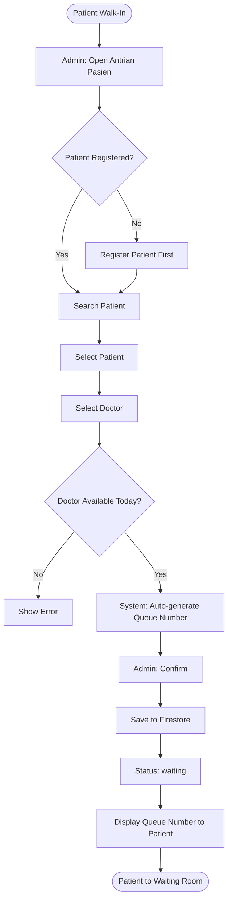

#### **3.2.2 Admin Actions on Queue**

**Available Actions:**

| Action | Trigger | Status Change | Business Logic |
|--------|---------|---------------|----------------|
| **Confirm Booking** | Online booking received | waiting → confirmed | Admin verifies patient info via phone |
| **Call Patient** | Patient turn in queue | confirmed → called | Set `calledAt` timestamp, display on monitor |
| **Start Examination** | Doctor ready | called → in-progress | Create encounter, link to queue |
| **Complete** | Examination done | any → done | Set `doneAt` timestamp |
| **Cancel** | Patient no-show | any → cancelled | Record reason, free up slot |

**BR-QM-008: Queue Status Rules**
- Only Admin can update status (Dokter cannot)
- Status can only move forward (except cancel)
- Called status triggers display on waiting room monitor
- One queue = One encounter (1:1 relationship)

---

### 3.3 Queue Monitoring Process

#### **3.3.1 Waiting Room Display**

**Purpose:** Real-time display untuk pasien di ruang tunggu

**Display Content:**
- Current called number (large font)
- Next 3-5 numbers
- Doctor name and room
- Estimated wait time

**Update Mechanism:**
- Real-time listener on Firestore `antrian` collection
- Filter: `status = 'called'` and `tanggal = today`
- Auto-refresh setiap 5 detik

**BR-QM-009: Display Rules**
- Show only called status (not waiting/confirmed)
- Sort by `calledAt` timestamp (latest first)
- Show max 5 recent calls (scroll if more)

#### **3.3.2 Admin Queue Dashboard**

**Filters:**
- By Date (default: today)
- By Doctor (default: all)
- By Status (default: waiting, confirmed, called)

**Metrics Displayed:**
- Total queue today
- Waiting count
- Called count
- Done count
- Cancelled count
- Average wait time

---

### 3.4 Doctor Schedule Management

#### **3.4.1 Schedule Configuration**

**Entity:** `jadwalDokter` collection

**Fields:**
- `practitionerId` - Reference to doctor
- `hari` - Day of week (Senin, Selasa, ..., Minggu)
- `jamBuka` - Start time (HH:mm)
- `jamTutup` - End time (HH:mm)
- `kuota` - Max patients per day (optional)
- `isActive` - Enable/disable schedule

**Business Rules:**
- **BR-QM-010:** One doctor can have multiple schedules per week
- **BR-QM-011:** Schedule can overlap (e.g., doctor works 08:00-12:00 and 14:00-17:00)
- **BR-QM-012:** Inactive schedules tidak tampil di booking online

#### **3.4.2 Schedule Override (Holiday, Leave)**

**⚠️ Gap Identified:**
- Tidak ada fitur untuk override schedule (cuti dokter, libur nasional)
- Harus manual deactivate schedule

**Recommendation:**
- Add `tanggalException` field (array of dates)
- Add `tanggalKhusus` for special schedules (weekend shift)

---

## 4. CLINICAL DOCUMENTATION PROCESS

### 4.1 Encounter Creation & Status Flow

#### **4.1.1 Encounter Lifecycle**

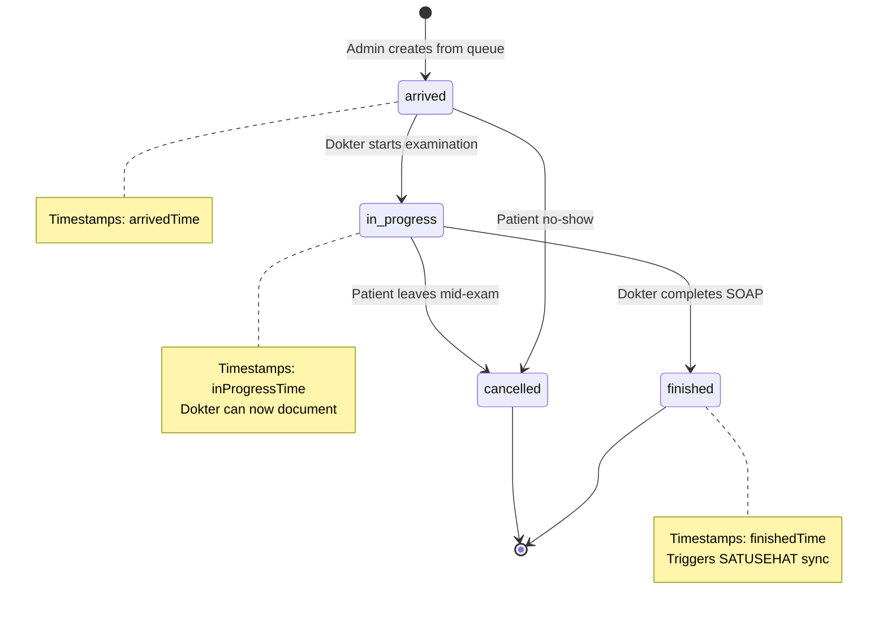

#### **4.1.2 Encounter Creation Process**

**Actor:** Admin or Dokter

**Process:**
1. **From Queue:**
   - Admin/Dokter select queue item with status "called"
   - Click "Buat Kunjungan" button
   - System auto-fills: patient, practitioner, location
   - Confirm → Create encounter with status "arrived"

2. **Walk-In (No Queue):**
   - Admin click "Buat Kunjungan" dari menu
   - Search and select patient
   - Select practitioner
   - Select location
   - Input chief complaint
   - Save → Encounter created

**Business Rules:**
- **BR-ED-001:** One queue can only create one encounter
- **BR-ED-002:** One patient can have multiple encounters per day (different doctors)
- **BR-ED-003:** Encounter creation does NOT auto-change queue status to "done"

---

### 4.2 SOAP Documentation Process

#### **4.2.1 Documentation Sequence**

**Recommended Flow (Not Enforced):**
```
1. Anamnesis (Subjective)
   ↓
2. Vital Signs (Objective - Physical)
   ↓
3. OHI-S / Odontogram (Objective - Dental)
   ↓
4. Diagnosis (Assessment)
   ↓
5. Prosedur (Plan - Interventions)
   ↓
6. Resep (Plan - Medications)
```

**Note:** System allows filling tabs in any order. Dokter bisa skip antar tab.

#### **4.2.2 Tab 1: Anamnesis**

**Purpose:** Record subjective information from patient

**Fields:**

| Field | Type | FHIR Mapping | Business Rule |
|-------|------|--------------|---------------|
| **Keluhan Utama** | Text area | Condition (category: chief-complaint) | Required for first save |
| **Riwayat Penyakit** | Text area | Condition (category: medical-history) | Optional |
| **Golongan Darah** | Dropdown (A/B/AB/O) | Observation (LOINC: blood type) | Optional |
| **Rhesus** | Dropdown (+/-) | Observation (LOINC: Rh) | Optional |
| **Status Kehamilan** | Dropdown (Pregnant/Not) | Observation (SNOMED: pregnancy status) | Only for female patients |
| **Alergi** | Array of objects | AllergyIntolerance | Optional, can add multiple |
| **Obat Saat Ini** | Array of objects | MedicationStatement | Optional, can add multiple |

**Alergi Object Structure:**
- `substansi` (string) - Allergen name
- `reaksi` (string) - Reaction description
- `tingkat` (dropdown: low/moderate/high) - Severity

**Obat Saat Ini Object Structure:**
- `namaObat` (string) - Medication name
- `dosis` (string) - Dosage
- `frekuensi` (string) - Frequency

**Save Behavior:**
- Auto-save on blur (⚠️ verify if implemented)
- Or explicit "Simpan" button
- Sync to SATUSEHAT immediately (if encounter status = finished)

**Business Rules:**
- **BR-AN-001:** Keluhan Utama required before can finish encounter
- **BR-AN-002:** Status kehamilan only shown if patient.gender = female
- **BR-AN-003:** Each alergi becomes separate AllergyIntolerance resource in SATUSEHAT
- **BR-AN-004:** Riwayat obat sync as MedicationStatement (not MedicationRequest)

---

#### **4.2.3 Tab 2: Vital Signs**

**Purpose:** Record objective measurements

**Fields & LOINC Codes:**

| Measurement | LOINC Code | Unit | Normal Range | Validation Range |
|-------------|-----------|------|--------------|------------------|
| **Tekanan Darah Sistolik** | 8480-6 | mmHg | 90-120 | 60-250 |
| **Tekanan Darah Diastolik** | 8462-4 | mmHg | 60-80 | 40-150 |
| **Nadi** | 8867-4 | /menit | 60-100 | 30-250 |
| **Pernapasan** | 9279-1 | /menit | 12-20 | 10-60 |
| **Suhu Tubuh** | 8310-5 | °C | 36.0-37.5 | 34.0-42.0 |

**Save Behavior:**
- Individual save per vital sign
- Stored in subcollection: `encounters/{encId}/vitalSigns/{loincCode}`
- Document ID = LOINC code (upsert on re-save)

**SATUSEHAT Sync:**
- Each vital sign = one Observation resource
- DateTime offset trick: 0s, 2s, 4s, 6s, 8s to avoid duplicate detection
- All observations linked to same encounter

**Business Rules:**
- **BR-VS-001:** At least one vital sign required (recommended: BP, pulse, temp)
- **BR-VS-002:** Out-of-range values show warning but can still save
- **BR-VS-003:** Historical vital signs displayed as chart (trend analysis)
- **BR-VS-004:** Decimal allowed for temperature (e.g., 36.5°C)

---

#### **4.2.4 Tab 3: OHI-S (Oral Hygiene Index Simplified)**

**Purpose:** Assess oral hygiene for dental patients

**Method:** Score 12 tooth surfaces (6 teeth × 2 surfaces)

**Teeth Assessed (FDI Notation):**
- Maxilla: 16 (buccal, palatal), 11 (labial, palatal), 26 (buccal, palatal)
- Mandibula: 46 (buccal, lingual), 31 (labial, lingual), 36 (buccal, lingual)

**Scoring (0-3):**
- **Debris Index (DI):** 0 = no debris, 3 = debris covering >2/3 surface
- **Calculus Index (CI):** 0 = no calculus, 3 = heavy calculus

**Calculation:**
- DI-S = Average of all debris scores
- CI-S = Average of all calculus scores
- OHI-S = DI-S + CI-S

**Interpretation:**
- 0.0 - 1.2: Baik (Good)
- 1.3 - 3.0: Sedang (Fair)
- 3.1 - 6.0: Buruk (Poor)

**FHIR Mapping:**
- Category: Exam (SNOMED: 5880005)
- KEMKES codes untuk debris dan calculus index
- 12 Observations untuk individual surfaces
- 3 Observations untuk summary (DI-S, CI-S, OHI-S)

**Business Rules:**
- **BR-OH-001:** Optional for non-dental encounters
- **BR-OH-002:** Required for dental hygiene assessment
- **BR-OH-003:** Can re-assess in follow-up visits (historical comparison)

---

#### **4.2.5 Tab 4: Odontogram**

**Purpose:** Visual chart of dental conditions

**Tooth Notation:** FDI (Federation Dentaire Internationale)
- Permanent: 11-18, 21-28, 31-38, 41-48 (32 teeth)
- Deciduous: 51-55, 61-65, 71-75, 81-85 (20 teeth)

**Condition Codes:**

**Surface Conditions:**
- `karies` - Caries (cavity)
- `komposit` - Composite restoration
- `gic` - Glass-ionomer cement
- `amalgam` - Amalgam filling
- (extensible list)

**Overall Status (Above Tooth):**
- `SOU` - Sound (healthy)
- `ATT` - Attrition (wear)
- `PRE` - Partially erupted
- `UNE` - Unerupted
- `ANO` - Anomaly
- `NON` - Non-vital

**Overall Status (Below Tooth):**
- `MISSING` - Tooth missing
- `CFR` - Crown/root fracture
- `RRX` - Radix (root remnant)

**Additional Flags:**
- `RCT` - Root canal treatment performed

**DMF-T Index:**
- **D** - Decayed teeth count
- **M** - Missing teeth count
- **F** - Filled teeth count
- **Total DMF-T** = D + M + F (indicator of dental health history)

**SATUSEHAT Sync:**
- Smart sync: GET existing observations first, map by tooth label
- If exists: PUT (update), if new: POST (create)
- Prevents duplicate creation errors

**Business Rules:**
- **BR-OD-001:** Optional for non-dental encounters
- **BR-OD-002:** Each tooth condition = one Observation
- **BR-OD-003:** DMF-T summary = separate Observation
- **BR-OD-004:** Can update odontogram in follow-up (track changes over time)

---

#### **4.2.6 Tab 5: Diagnosis**

**Purpose:** Record ICD-10 coded diagnoses

**Interface:**
- Autocomplete search dari `assets/icd/icd10.json`
- Search by code atau description
- Fuzzy matching
- Limit 25 results per search

**Fields per Diagnosis:**

| Field | Type | Options | Required |
|-------|------|---------|----------|
| **Code** | Text (ICD-10) | From search | Yes |
| **Display** | Text | From search | Yes |
| **Clinical Status** | Dropdown | active, inactive, resolved, recurrence, relapse, remission | Yes (default: active) |
| **Category** | Dropdown | encounter-diagnosis, problem-list-item | Yes (default: encounter-diagnosis) |
| **Body Site** | Dropdown (SNOMED) | Whitelist of 40+ oral/dental codes | Optional |
| **Onset Date** | DateTime | - | Optional |
| **Note** | Text area | - | Optional |

**Body Site Whitelist (SNOMED CT):**
- Mouth structures: 74262004, 21082005
- Teeth: 38199008, 11402002, 76505004, etc.
- Gingiva: 38552002
- Periodontal: 8711009
- Jaw: 91609006, 70258002
- *(40+ codes total)*

**Multiple Diagnoses:**
- Can add unlimited diagnoses per encounter
- First diagnosis = primary diagnosis
- Subsequent = secondary/comorbid

**SATUSEHAT Sync:**
- Each diagnosis = one Condition resource
- Category: encounter-diagnosis (for billing) or problem-list-item (for chronic)

**Business Rules:**
- **BR-DG-001:** At least one diagnosis required to finish encounter
- **BR-DG-002:** Only whitelisted SNOMED codes accepted for body site (validation)
- **BR-DG-003:** Primary diagnosis used for encounter.diagnosis reference
- **BR-DG-004:** Active status displayed prominently in patient summary

---

#### **4.2.7 Tab 6: Prosedur (Procedures)**

**Purpose:** Record procedures performed during encounter

**Interface:**
- Select from predefined templates:
  - Custom (generic procedure)
  - Dental Scaling (code: 96.54)
  - Root Canal (code: 23.71)
  - Tooth Extraction (code: 23.09)
  - Dental Restoration (23.2)
- Or manual ICD-9-CM code entry

**Fields:**

| Field | Type | Required |
|-------|------|----------|
| **Procedure Code** | ICD-9-CM | Yes |
| **Procedure Name** | Text | Yes |
| **Status** | Dropdown (preparation, in-progress, completed, not-done, stopped) | Yes (default: completed) |
| **Performed Start** | DateTime | Yes |
| **Performed End** | DateTime | Optional (default: same as start) |
| **Reason** | ICD-10 code | Optional (link to diagnosis) |
| **Tooth Number** | FDI notation | Optional (for dental procedures) |
| **Note** | Text area | Optional |

**SATUSEHAT Mapping:**
- Resource: Procedure (FHIR R4)
- Category: Therapeutic procedure (SNOMED: 277132007)
- Performer: practitionerId

**Business Rules:**
- **BR-PR-001:** Multiple procedures can be recorded per encounter
- **BR-PR-002:** Procedure code must be valid ICD-9-CM
- **BR-PR-003:** Performed datetime cannot be in future
- **BR-PR-004:** Procedure linked to diagnosis via `reasonReference`
- **BR-PR-005:** For billing: Procedure codes linked to tarif table for charging

---

#### **4.2.8 Tab 7: Resep (Prescription)**

**Purpose:** E-prescription for medications

**⚠️ Implementation Gap:**
- Basic structure exists (MedicationRequest)
- UI not fully detailed in source code analysis
- Likely similar to "Obat Saat Ini" in anamnesis

**Expected Fields:**

| Field | Type | Required |
|-------|------|----------|
| **Medication Name** | Text/Dropdown | Yes |
| **Strength** | Text (e.g., "500mg") | Yes |
| **Dosage Form** | Dropdown (tablet, kapsul, sirup, injeksi) | Yes |
| **Dosage Instruction** | Text (e.g., "3x sehari 1 tablet") | Yes |
| **Quantity** | Number | Yes |
| **Duration** | Number + Unit (days/weeks) | Yes |
| **Note** | Text (e.g., "Sesudah makan") | Optional |

**SATUSEHAT Mapping:**
- Resource: MedicationRequest (FHIR R4)
- Status: active
- Intent: order
- Requester: practitionerId
- Subject: patientId

**Business Rules:**
- **BR-RX-001:** Prescription must be signed by licensed practitioner
- **BR-RX-002:** Cannot modify prescription after dispensed
- **BR-RX-003:** Prescription validity: 30 days (⚠️ not enforced in code)
- **BR-RX-004:** Duplicate medication check (warning if same drug prescribed twice)

---

### 4.3 Encounter Completion Process

#### **4.3.1 Finish Encounter Workflow**

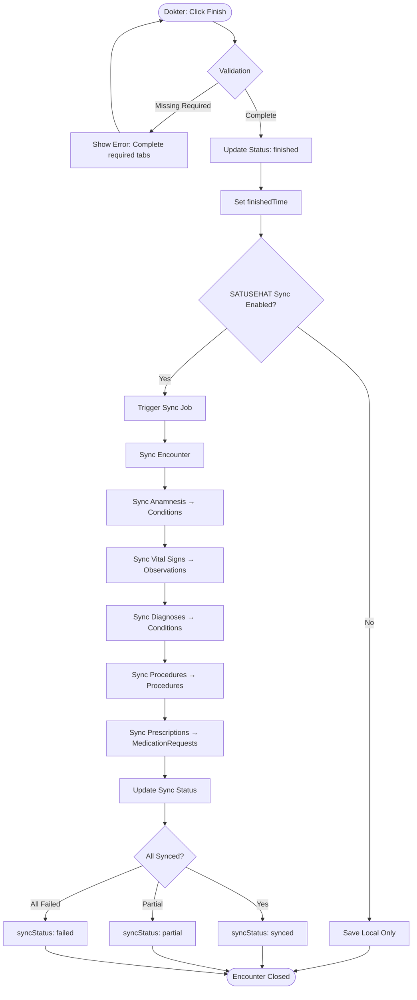

#### **4.3.2 Required Fields Validation**

**Before Finishing Encounter:**
- ✅ At least one entry in Anamnesis (Keluhan Utama)
- ✅ At least one Vital Sign
- ✅ At least one Diagnosis (ICD-10)
- ⚠️ Procedures (optional but recommended)
- ⚠️ Prescription (optional, if treatment requires)

**Validation Error Message:**
"Dokumen belum lengkap. Pastikan sudah mengisi:
- Keluhan Utama
- Minimal 1 Tanda Vital
- Minimal 1 Diagnosis"

#### **4.3.3 Post-Completion Actions**

**Automatic:**
1. Encounter status → finished
2. Set finishedTime timestamp
3. Trigger SATUSEHAT sync (if configured)
4. Lock clinical tabs (read-only) *(⚠️ verify if implemented)*
5. Unlock billing (Admin can now process payment)

**Manual (Admin):**
1. Process billing
2. Dispense medications
3. Schedule follow-up (if needed)

**Business Rules:**
- **BR-EC-001:** Once finished, Dokter cannot edit clinical notes (prevent tampering)
- **BR-EC-002:** Owner can "Reopen" encounter if correction needed (with audit log)
- **BR-EC-003:** Finished encounter must sync to SATUSEHAT within 24 hours (compliance)

---

## 5. BILLING & PAYMENT PROCESS

### 5.1 Billing Input Process

#### **5.1.1 Process Flow**

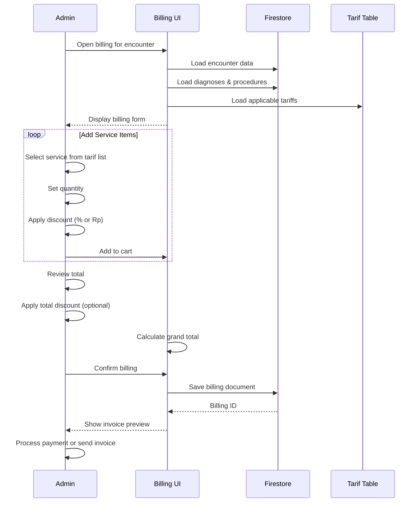

#### **5.1.2 Tarif (Service Price) Configuration**

**Entity:** `tarifHarga` collection

**Fields:**
- `nama` - Service name
- `kategori` - Category (e.g., "Konsultasi", "Tindakan", "Laboratorium")
- `kodeICD9` - Linked procedure code (optional)
- `hargaPokok` - Base cost
- `hargaJual` - Selling price
- `diskonMaksimal` - Maximum discount allowed (% or Rp)

**Pricing Models:**
- Fixed price
- Range pricing (min-max)
- Package pricing (bundle of services)

**Business Rules:**
- **BR-BL-001:** Tarif configured by Owner only
- **BR-BL-002:** Admin can only apply discount within allowed limit
- **BR-BL-003:** Price changes tidak affect existing billings (historical data)

---

### 5.2 Payment Processing

#### **5.2.1 Payment Methods**

| Method | Implementation | Receipt | Reconciliation |
|--------|---------------|---------|----------------|
| **Cash** | Manual entry | Printed | Daily cashier count |
| **Transfer** | Manual entry (proof photo TBD) | Printed | Bank statement match |
| **Insurance (BPJS/Swasta)** | Manual entry | Printed | Claim submission (⚠️ Gap) |
| **Credit Card/E-Wallet** | ⚠️ Not integrated | ⚠️ | ⚠️ |

#### **5.2.2 Partial Payment Process**

**Scenario:** Patient tidak bisa bayar penuh saat itu

**Process:**
1. Admin input total billing: Rp 1.000.000
2. Admin input payment received: Rp 500.000
3. System calculate outstanding: Rp 500.000
4. Create `receivable` record
5. Status: "Partial Payment"
6. Patient can pay installment di visit berikutnya

**Receivable Tracking:**
- Document per patient per billing
- Track: `totalAmount`, `paidAmount`, `outstandingAmount`
- Payment history array (each installment)
- Due date (⚠️ not implemented)

**Business Rules:**
- **BR-PY-001:** Partial payment allowed up to 3 installments (⚠️ not enforced)
- **BR-PY-002:** Minimum first payment: 30% (⚠️ not enforced)
- **BR-PY-003:** Outstanding receivables reported weekly to Owner

---

### 5.3 Invoice Generation

#### **5.3.1 Invoice Content**

**Header:**
- Invoice number (sequential)
- Issue date
- Clinic info (name, address, phone)
- Patient info (name, No. RM, NIK)

**Body:**
- Service item list (name, quantity, unit price, subtotal)
- Discounts (per item and total)
- Tax (if applicable - ⚠️ not implemented)
- Grand total

**Footer:**
- Payment method
- Amount paid
- Outstanding balance (if any)
- Kasir name and signature

**Format:**
- PDF (for print and email)
- ⚠️ Email sending not implemented

#### **5.3.2 Invoice Status**

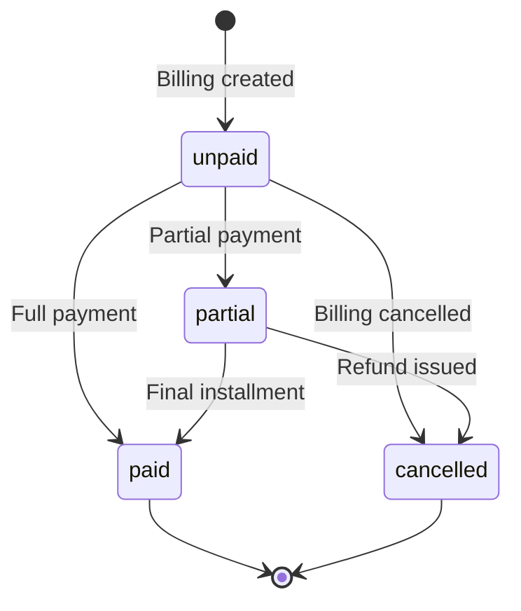

---

## 6. PHARMACY DISPENSING PROCESS

### 6.1 Medication Dispensing Workflow

#### **6.1.1 Process Flow**

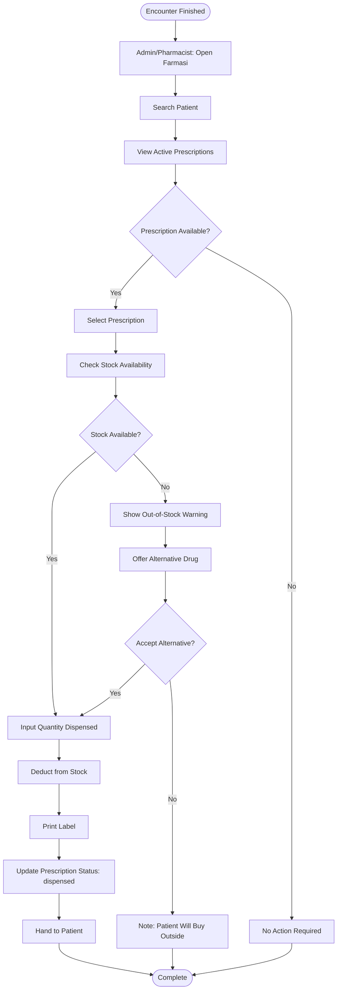

#### **6.1.2 Stock Management**

**Entity:** `medications` collection

**Fields:**
- `name`, `genericName`
- `strength`, `strengthUnit`
- `dosageForm`
- `quantity` - Current stock
- `minStock` - Reorder level
- `price`
- `supplier`
- `expirationDate`

**Stock Movement Tracking:**
- ⚠️ Gap: No dedicated `stockMovements` collection
- Movements implied from prescription dispensing

**Business Rules:**
- **BR-PH-001:** Cannot dispense if stock quantity < prescription quantity
- **BR-PH-002:** Alert when stock reaches minStock level
- **BR-PH-003:** Alert for medications expiring within 30 days
- **BR-PH-004:** First-In-First-Out (FIFO) for expiration management (⚠️ not enforced)

#### **6.1.3 Prescription Status**

| Status | Meaning | Actor |
|--------|---------|-------|
| **active** | Prescription written, not yet dispensed | Dokter |
| **dispensed** | Medication handed to patient | Admin/Pharmacist |
| **cancelled** | Prescription voided | Dokter/Admin |

---

### 6.2 Inventory Management (⚠️ Partially Implemented)

**Features Available:**
- Add new medication master data
- Update stock quantity (manual adjustment)
- View current stock levels

**Features Missing:**
- Purchase order management
- Supplier management (basic fields exist but no workflow)
- Stock in/out transaction log
- Batch number tracking
- Expiration date tracking per batch
- Automatic reorder point alerts
- Inventory valuation reports

**Recommendations:**
- Implement full inventory module with purchase orders
- Track batch numbers for recall capability
- Generate stock movement reports
- Integration with supplier for automated ordering

---

## 7. SATUSEHAT INTEGRATION PROCESS

### 7.1 Authentication Flow

#### **7.1.1 OAuth2 Token Management**

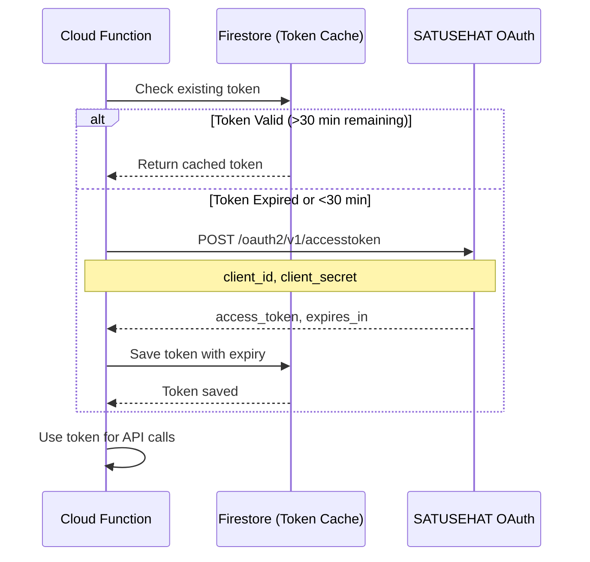

**Token Properties:**
- Type: Bearer token
- Expiration: 1 hour (3600 seconds)
- Refresh: Automatic jika <30 menit
- Scope: Organization-specific (isolasi per klinik)

**Storage:**
- Collection: `satusehatTokens`
- Document ID: `clinicId`
- Fields:
  - `accessToken`
  - `expiresAt` (timestamp)
  - `environment` ("sandbox" or "production")

**Business Rules:**
- **BR-SS-001:** Token tidak dishare antar klinik
- **BR-SS-002:** Token refresh transparent (no user action needed)
- **BR-SS-003:** Failed auth logged for troubleshooting

---

### 7.2 Resource Synchronization Strategy

#### **7.2.1 Sync Timing**

| Resource | Sync Trigger | Frequency | Direction |
|----------|-------------|-----------|-----------|
| **Organization** | Manual (setup) | One-time | Local → SATUSEHAT |
| **Location** | Manual (setup) | One-time | Local → SATUSEHAT |
| **Practitioner** | Manual (add practitioner) | Per practitioner | SATUSEHAT → Local (search)<br>Local → SATUSEHAT (register) |
| **Patient** | On registration | Per patient | SATUSEHAT → Local (search)<br>Local → SATUSEHAT (register) |
| **Encounter** | On encounter create/update | Real-time | Local → SATUSEHAT |
| **Condition (Diagnosis)** | On diagnosis add | Real-time | Local → SATUSEHAT |
| **Observation (Vital Signs, OHI-S, Odontogram)** | On save | Real-time | Local → SATUSEHAT |
| **Procedure** | On procedure add | Real-time | Local → SATUSEHAT |
| **MedicationRequest** | On prescription save | Real-time | Local → SATUSEHAT |
| **AllergyIntolerance** | On allergy add | Real-time | Local → SATUSEHAT |
| **MedicationStatement** | On riwayat obat save | Real-time | Local → SATUSEHAT |

#### **7.2.2 Sync Workflow (Generic)**

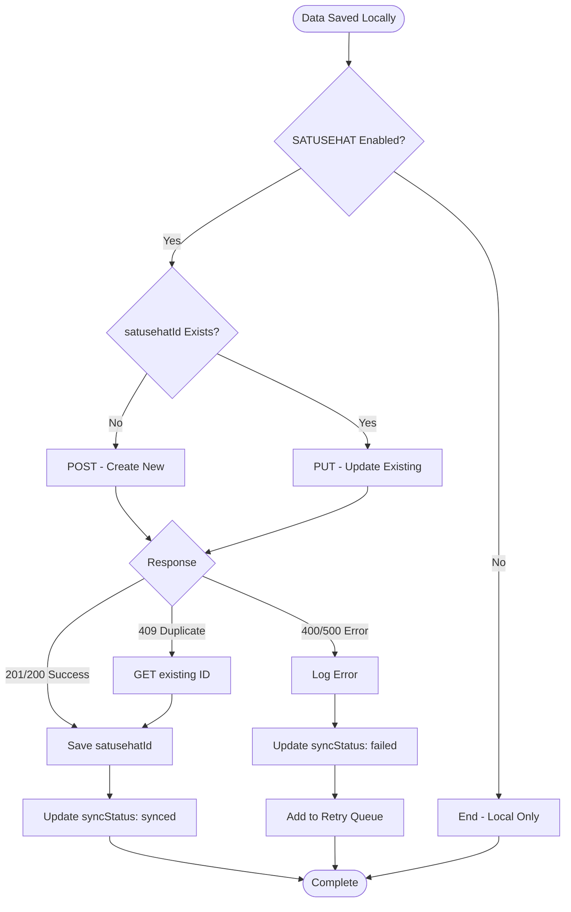

#### **7.2.3 Error Handling**

**Common Errors:**

| HTTP Code | Error | Cause | Handling |
|-----------|-------|-------|----------|
| **400** | Bad Request | Invalid FHIR format | Log details, show error to user, need manual fix |
| **401** | Unauthorized | Token expired/invalid | Auto-refresh token, retry |
| **404** | Not Found | Resource ID not found in SATUSEHAT | Treat as new, POST instead of PUT |
| **409** | Conflict | Duplicate identifier | GET existing ID, update local reference |
| **422** | Unprocessable Entity | Business rule violation (e.g., invalid code) | Show specific validation error |
| **500** | Internal Server Error | SATUSEHAT server issue | Retry dengan exponential backoff |
| **503** | Service Unavailable | SATUSEHAT maintenance | Queue for retry later |

**Retry Policy:**
- Immediate retry: 401 (after token refresh)
- Exponential backoff: 500, 503 (wait 1min, 2min, 4min, ...)
- Max retries: 3
- After max retries: Mark as failed, require manual review

**Business Rules:**
- **BR-SS-004:** Local data always saved first (local-first strategy)
- **BR-SS-005:** Sync failure does not block user workflow
- **BR-SS-006:** Owner can view sync status report
- **BR-SS-007:** Failed syncs retried automatically every 1 hour
- **BR-SS-008:** Owner can manually trigger re-sync

---

### 7.3 Smart Sync (Odontogram Case Study)

**Problem:** Odontogram has 50+ observations. Naïve approach:
- Delete all old observations
- POST all new observations
- Result: Duplicate errors, slow performance

**Smart Sync Solution:**
1. **GET Existing:** Query SATUSEHAT for all observations linked to encounter
2. **Map by Key:** Create map by tooth label + SNOMED code + KEMKES code
3. **Compare:**
   - If observation exists: PUT (update)
   - If new observation: POST (create)
   - If observation deleted locally: DELETE in SATUSEHAT (⚠️ not implemented)

**Benefits:**
- Prevents duplicate creation
- Faster sync (only changed observations)
- Preserves SATUSEHAT resource IDs

**Business Rules:**
- **BR-SS-009:** Smart sync used for bulk observations (odontogram, OHI-S)
- **BR-SS-010:** Regular sync used for single resources (diagnosis, procedure)

---

## 8. USER MANAGEMENT PROCESS

### 8.1 New User Registration & Activation

#### **8.1.1 Process Flow**

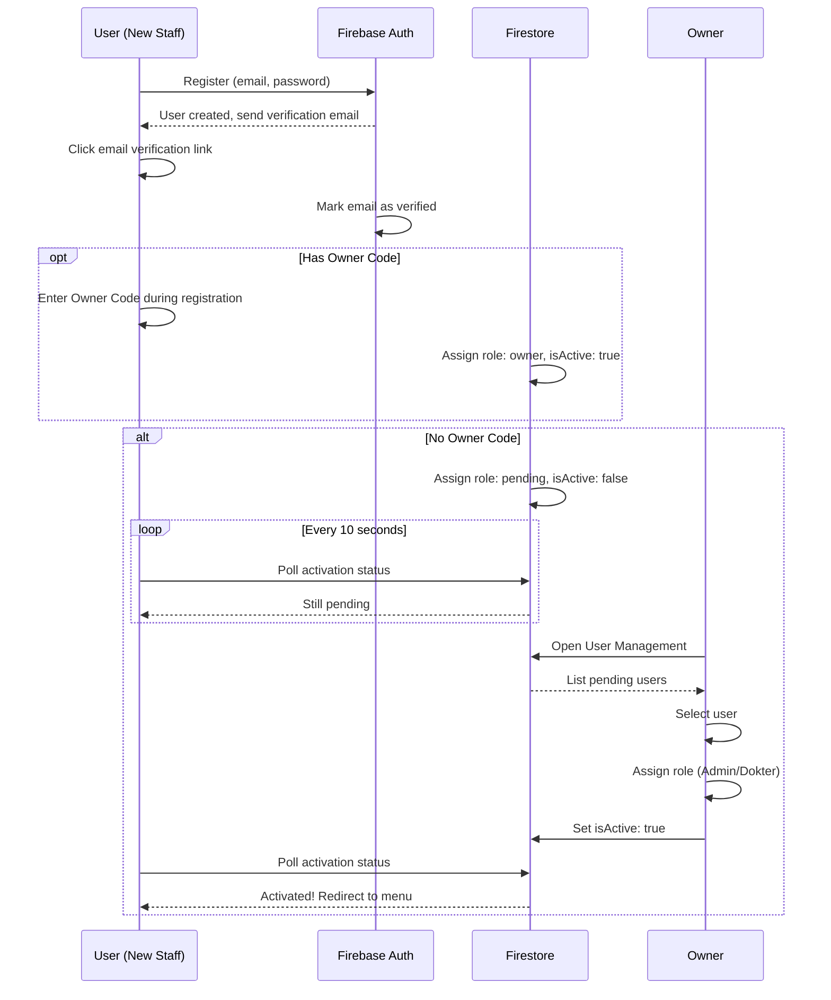

#### **8.1.2 Owner Activation Workflow**

**Steps for Owner:**
1. Login to system
2. Navigate to "Pengaturan" → "User Management"
3. View list of pending users with:
   - Name
   - Email
   - Registration date
4. For each user:
   - Verify identity (telepon, interview, ID check)
   - Click "Aktivasi"
   - Select role from dropdown:
     - Admin
     - Dokter
   - If Dokter: Link to practitionerId (from Practitioner list)
   - Click "Simpan"
5. User auto-notified via polling mechanism

**Business Rules:**
- **BR-UM-001:** Only Owner can activate users
- **BR-UM-002:** Owner must verify identity before activation (security)
- **BR-UM-003:** Dokter role requires valid practitionerId (registered in SATUSEHAT)
- **BR-UM-004:** Cannot activate user without assigning role
- **BR-UM-005:** Owner code is secret, provided by system developer only

---

### 8.2 User Deactivation Process

**Scenario:** Staff berhenti bekerja atau suspended

**Process:**
1. Owner navigate to User Management
2. Select active user
3. Click "Nonaktifkan"
4. Input reason (optional)
5. Confirm
6. System sets `isActive: false`
7. User logged out (if currently logged in)
8. User cannot login until reactivated

**Business Rules:**
- **BR-UM-006:** Owner cannot deactivate self
- **BR-UM-007:** Deactivated user's data (encounters, transactions) remain in system
- **BR-UM-008:** Can reactivate later (restore isActive: true)

---

### 8.3 Role Change Process (⚠️ Not Implemented)

**Current Limitation:**
- No UI for changing role after initial assignment
- Must deactivate user → user re-register → assign new role

**Recommended Implementation:**
1. Owner select user
2. Click "Ubah Role"
3. Select new role
4. Confirmation dialog dengan warning tentang impact
5. Update role
6. Log di audit trail
7. User logout otomatis (must login again with new role)

---

## 9. STATUS TRANSITIONS

### 9.1 Queue Status Transitions

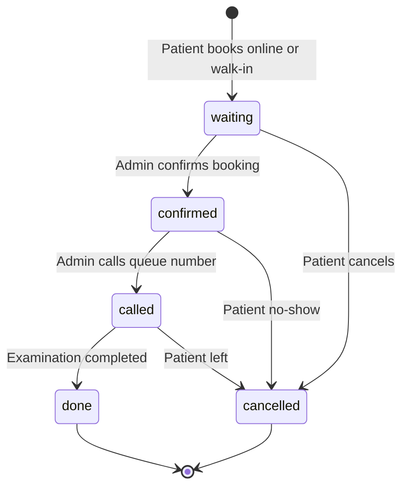

**Allowed Transitions:**

| From | To | Actor | Business Rule |
|------|----|-|-------|
| waiting | confirmed | Admin | Online booking confirmation |
| waiting | cancelled | Admin/Patient | Cancellation before called |
| confirmed | called | Admin | Patient called to exam room |
| confirmed | cancelled | Admin | No-show after 15 min grace period |
| called | done | Admin | After encounter finished |
| called | cancelled | Admin | Patient left mid-process |

**Forbidden Transitions:**
- ❌ called → waiting (cannot revert)
- ❌ done → any (final state)
- ❌ cancelled → any (final state)

---

### 9.2 Encounter Status Transitions

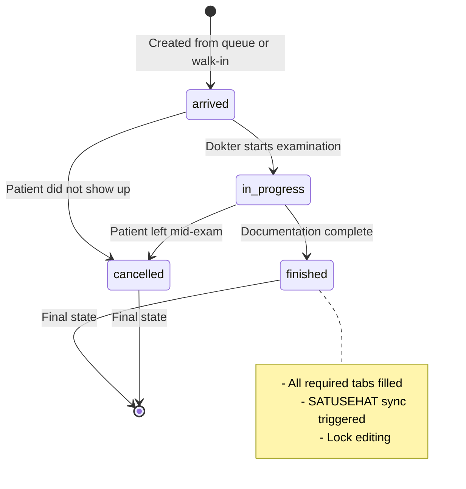

**Allowed Transitions:**

| From | To | Actor | Validation |
|------|----|-|-------|
| arrived | in-progress | Dokter | - |
| arrived | cancelled | Admin/Dokter | Reason required |
| in-progress | finished | Dokter | Required fields complete |
| in-progress | cancelled | Dokter | Reason required |

**Forbidden Transitions:**
- ❌ in-progress → arrived (cannot revert)
- ❌ finished → in-progress (cannot reopen without Owner approval)
- ❌ finished → cancelled (cannot cancel after finished)
- ❌ cancelled → any (cannot resurrect)

**Business Rules:**
- **BR-ST-001:** Status can only move forward (except cancel)
- **BR-ST-002:** Timestamp captured for each status change
- **BR-ST-003:** Status history logged for audit

---

### 9.3 Billing/Payment Status Transitions

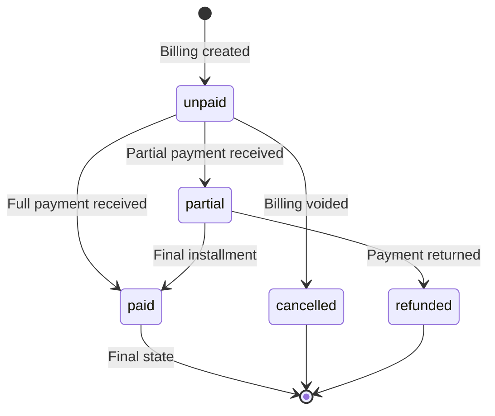

**Allowed Transitions:**

| From | To | Actor | Condition |
|------|----|-|-------|
| unpaid | paid | Admin | Full amount collected |
| unpaid | partial | Admin | Partial amount collected |
| partial | paid | Admin | Remaining amount collected |
| unpaid | cancelled | Admin/Owner | Billing error, service not rendered |
| paid | refunded | Owner | Refund approved (special case) |

**Forbidden Transitions:**
- ❌ paid → unpaid (use refunded instead)
- ❌ cancelled → paid (cannot revive)

---

### 9.4 Prescription Status Transitions

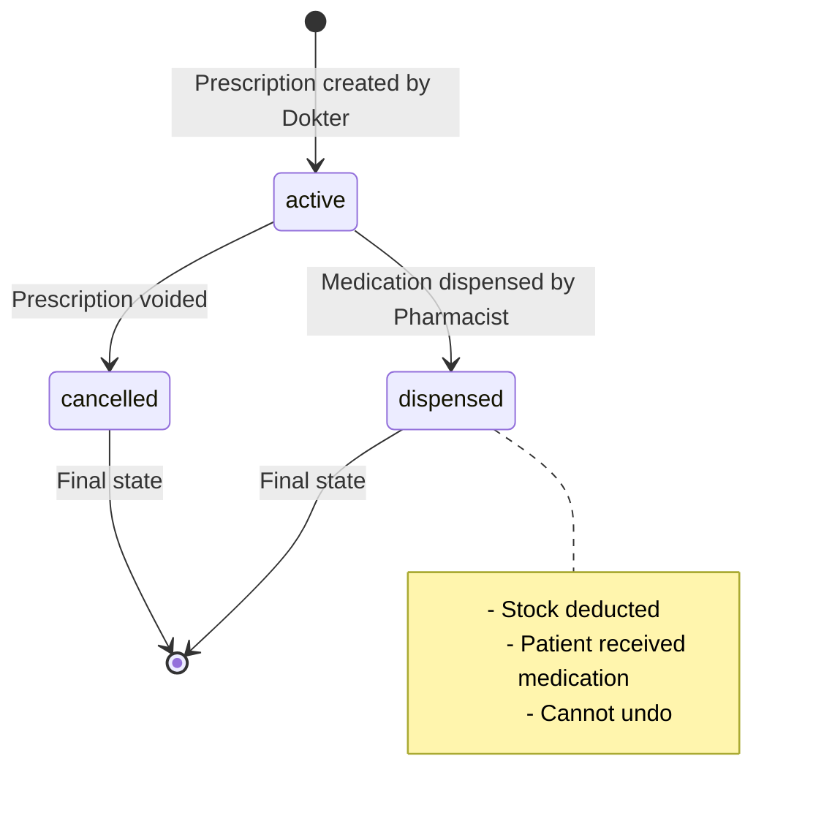

---

## 10. EXCEPTION HANDLING

### 10.1 System Exceptions

#### **EX-001: Internet Connection Lost**

**Scenario:** User working offline (Firebase offline persistence)

**Handling:**
- ✅ Firestore SDK enables offline persistence
- ✅ User can continue entering data
- ✅ Data queued locally
- ✅ Auto-sync when connection restored
- ❌ SATUSEHAT API calls fail (deferred until online)

**User Notification:**
- Show offline indicator in UI
- Warn: "Offline mode - data will sync when online"

---

#### **EX-002: SATUSEHAT API Down**

**Scenario:** SATUSEHAT server maintenance or outage

**Handling:**
- ✅ Local save proceeds normally
- ✅ Sync status set to "pending"
- ✅ Retry job scheduled
- ✅ Owner notified via sync status report

**Business Continuity:**
- Clinical work continues uninterrupted
- Compliance: Must sync within 24 hours (regulatory requirement)
- If >24h outage: Notify Kemenkes (outside system scope)

---

#### **EX-003: Firestore Quota Exceeded**

**Scenario:** High traffic exceeds Firebase free tier

**Handling:**
- ⚠️ System becomes unavailable
- Admin must upgrade Firebase plan
- No data loss (but writes blocked)

**Prevention:**
- Monitor Firebase usage dashboard
- Set alerts at 80% quota
- Upgrade plan proactively

---

### 10.2 Business Process Exceptions

#### **EX-101: Patient No-Show**

**Scenario:** Patient booked appointment but tidak datang

**Handling:**
1. Admin wait 15 minutes grace period
2. Try call patient via phone
3. If no response: Update queue status to "cancelled"
4. Reason: "No-show"
5. Slot freed for walk-in patients

**Impact on Metrics:**
- No-show rate tracked for analytics
- Repeated no-shows may require deposit policy

---

#### **EX-102: Emergency Walk-In (No Appointment)**

**Scenario:** Patient datang emergency, semua slot penuh

**Handling:**
1. Admin assess urgency
2. If true emergency: Create queue with priority flag
3. Insert to front of queue
4. Notify other patients of delay
5. Dokter handles emergency first

**⚠️ Priority Queue Not Implemented:**
- Current: Manual workaround (Admin creates queue dengan nomor kecil)
- Recommendation: Add `priority` field (normal/urgent/emergency)

---

#### **EX-103: Incomplete Clinical Documentation**

**Scenario:** Dokter finish encounter tanpa mengisi tab required

**Handling:**
- System blocks finishing action
- Show validation error: "Harap lengkapi: [list missing items]"
- Dokter must fill before dapat finish

**Override (Emergency Exit):**
- Owner dapat override dengan approval
- Logged di audit trail
- Follow-up task created untuk complete documentation

---

#### **EX-104: Stock Out During Dispensing**

**Scenario:** Resep sudah ditulis, tetapi obat habis saat dispensing

**Handling:**
1. Pharmacist notify Admin
2. Admin check alternative drug (generik)
3. If available: Dispense alternative + note di system
4. If not available:
   - Note: "Patient to buy outside"
   - Print prescription for external pharmacy
   - Update stock reorder

**⚠️ Alternative Drug Mapping Not Implemented:**
- Current: Manual decision by Pharmacist
- Recommendation: Build generic drug mapping table

---

#### **EX-105: Payment Dispute**

**Scenario:** Patient tidak setuju dengan tagihan

**Handling:**
1. Admin escalate to Owner
2. Owner review encounter + billing detail
3. If error found:
   - Owner adjust billing
   - Log reason
   - Re-calculate
4. If no error:
   - Owner explain charges to patient
   - Refer to tarif published (transparency)

**Prevention:**
- Display estimated cost before examination (⚠️ not implemented)
- Clear tarif communication

---

#### **EX-106: Dokter Tidak Tersedia**

**Scenario:** Dokter scheduled tetapi tiba-tiba sakit/cuti

**Handling:**
1. Admin notify affected patients (via phone/WA)
2. Offer reschedule or see alternative doctor
3. Cancel/reschedule appointments in system
4. Update jadwal dokter (mark as unavailable)

**⚠️ Automated Notification Not Implemented:**
- Current: Manual phone calls
- Recommendation: SMS/WA blast to affected patients

---

## 11. PROCESS IMPROVEMENT RECOMMENDATIONS

### 11.1 Quick Wins (Low Effort, High Impact)

1. **SMS/WhatsApp Notifications**
   - Booking confirmation
   - Reminder H-1
   - Queue number called alert
   - Prescription ready notification

2. **Appointment Estimated Cost**
   - Show estimated cost based on service type before booking
   - Increase payment success rate

3. **SOAP Templates Library**
   - Pre-built templates for common conditions
   - Shared by Owner across all dokters
   - Reduce documentation time by 50%

4. **Daily Reconciliation Report (Auto-Email)**
   - End-of-day report to Owner
   - Summary: Patients seen, revenue, outstanding payments
   - Improve financial oversight

### 11.2 Medium-Term (3-6 Months)

1. **Patient Portal**
   - Patients can login and view own medical records
   - Download lab results
   - Pay invoices online
   - Request repeat prescriptions

2. **Integration with Lab Systems**
   - Auto-import lab results
   - Link to encounters
   - Sync to SATUSEHAT as Observations

3. **Inventory Auto-Reorder**
   - When stock reaches reorder point, auto-generate PO
   - Integration with supplier for automated ordering

4. **Advanced Analytics Dashboard**
   - Revenue trends
   - Patient demographics
   - Popular procedures
   - Dokter performance metrics

### 11.3 Long-Term (6-12 Months)

1. **AI-Assisted Diagnosis**
   - ICD-10 suggestions based on chief complaint
   - SNOMED code recommendations

2. **Telemedicine Module**
   - Video consultation
   - Remote prescription
   - E-signature

3. **Multi-Branch Management**
   - Clinic chain support
   - Centralized patient database
   - Cross-branch referrals
   - Consolidated reporting

4. **BPJS Integration**
   - Auto-claim submission
   - Eligibility verification
   - Payment reconciliation

---

## 12. PROCESS METRICS & KPIs

### 12.1 Operational Efficiency KPIs

| Metric | Target | Measurement |
|--------|--------|-------------|
| **Average Registration Time** | <5 min | Timestamp from form open to save |
| **Average Queue Wait Time** | <30 min | calledAt - arrivedTime |
| **Average Examination Duration** | 15-20 min | finishedTime - inProgressTime |
| **SOAP Documentation Completion Rate** | >90% | % encounters with all required tabs |
| **Same-Day Billing Rate** | >95% | % encounters billed on same day |
| **Prescription Dispensing Time** | <5 min | Timestamp from prescription to dispensed |

### 12.2 Quality KPIs

| Metric | Target | Measurement |
|--------|--------|-------------|
| **SATUSEHAT Sync Success Rate** | >95% | (Synced / Total) × 100% |
| **Billing Accuracy** | <2% disputes | Dispute count / Total billings |
| **Stock-Out Incidents** | <5/month | Count of out-of-stock during dispensing |
| **Patient No-Show Rate** | <10% | Cancelled (no-show) / Total bookings |
| **Data Completeness Score** | >85% | % complete fields in encounters |

### 12.3 Business Performance KPIs

| Metric | Target | Measurement |
|--------|--------|-------------|
| **Daily Patient Throughput** | 50+ patients | Count encounters finished per day |
| **Revenue per Patient Visit** | Rp 300K+ | Average billing amount |
| **Collection Rate** | >90% | Cash collected / Total billings |
| **Outstanding Receivables** | <10% revenue | Total receivables / Monthly revenue |

---

**END OF DOCUMENT**

---

**Catatan:** Dokumen ini merupakan hasil analisis source code existing. Semua process flow, business rules, dan status transitions diderivasi dari implementasi aktual di kode. Untuk detail implementasi teknis, lihat source code di repository.
