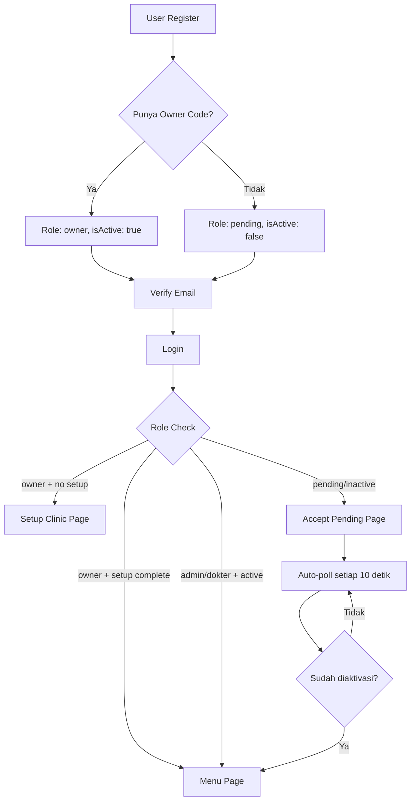

# USER ROLE MATRIX
# ApexRecord - Sistem Manajemen Klinik Kesehatan

**Versi:** 1.0  
**Tanggal:** 10 Juni 2026

---

## 1. OVERVIEW USER ROLES

### 1.1 Hierarki Role

```
┌─────────────────────────────────┐
│          OWNER                  │  ← Full Access
│    (Pemilik Klinik)             │
└────────────┬────────────────────┘
             │
      ┌──────┴──────┐
      │             │
┌─────▼──────┐ ┌───▼──────────┐
│   ADMIN    │ │    DOKTER    │
│ (Front Desk)│ │ (Clinician) │
└────────────┘ └──────────────┘
                     │
                     │
               ┌────▼─────────┐
               │   FARMASI    │  ← Subset akses
               │  (Pharmacy)  │     (Belum fully implemented)
               └──────────────┘
```

### 1.2 Role Summary

| Role | Jumlah User Tipikal | Fokus Kerja | Akses Level |
|------|---------------------|-------------|-------------|
| **OWNER** | 1-2 per klinik | Strategy, Oversight, Reporting | Full Access (Admin + Clinical) |
| **ADMIN** | 2-5 per klinik | Operasional, Administrasi, Kasir | Operational Access |
| **DOKTER** | 1-10 per klinik | Clinical Documentation | Clinical Access |
| **PENDING** | Variable | Menunggu Aktivasi | No Access |

---

## 2. DETAILED ACCESS MATRIX

### 2.1 Module Access Matrix

| Module / Feature | OWNER | ADMIN | DOKTER | PENDING | PASIEN |
|------------------|-------|-------|--------|---------|--------|
| **DASHBOARD** |
| Dashboard Overview | ✅ Full | ✅ Full | ✅ Full | ❌ | ❌ |
| **PASIEN (Patient Management)** |
| Lihat Daftar Pasien | ✅ | ✅ | ✅ Read | ❌ | ❌ |
| Tambah Pasien Baru | ✅ | ✅ | ❌ | ❌ | ❌ |
| Edit Data Pasien | ✅ | ✅ | ❌ | ❌ | ❌ |
| Search Patient (NIK/Name) | ✅ | ✅ | ✅ | ❌ | ❌ |
| **ANTRIAN (Queue Management)** |
| Lihat Antrian Hari Ini | ✅ | ✅ | ✅ Own | ❌ | ❌ |
| Tambah Antrian Walk-in | ✅ | ✅ | ❌ | ❌ | ❌ |
| Konfirmasi Booking Online | ✅ | ✅ | ❌ | ❌ | ❌ |
| Panggil Nomor Antrian | ✅ | ✅ | ❌ | ❌ | ❌ |
| Monitor Display Antrian | ✅ | ✅ | ✅ View | ❌ | ✅ View |
| Kelola Jadwal Dokter | ✅ | ✅ | ❌ | ❌ | ❌ |
| Daftar Antrian Online (Public) | ❌ | ❌ | ❌ | ❌ | ✅ |
| Cek Status Antrian (Token) | ❌ | ❌ | ❌ | ❌ | ✅ |
| **KUNJUNGAN (Encounter Management)** |
| Lihat Daftar Kunjungan | ✅ All | ✅ All | ✅ Own | ❌ | ❌ |
| Buat Encounter Baru | ✅ | ✅ | ⚠️ TBD | ❌ | ❌ |
| Update Status Encounter | ✅ | ✅ | ✅ Own | ❌ | ❌ |
| **DOKUMENTASI KLINIS** |
| Tab Anamnesis | ✅ | ❌ | ✅ Own | ❌ | ❌ |
| Tab Vital Signs | ✅ | ❌ | ✅ Own | ❌ | ❌ |
| Tab OHI-S (Oral Hygiene) | ✅ | ❌ | ✅ Own | ❌ | ❌ |
| Tab Odontogram | ✅ | ❌ | ✅ Own | ❌ | ❌ |
| Tab Diagnosis (ICD-10) | ✅ | ❌ | ✅ Own | ❌ | ❌ |
| Tab Prosedur (ICD-9) | ✅ | ❌ | ✅ Own | ❌ | ❌ |
| Tab Resep | ✅ | ❌ | ✅ Own | ❌ | ❌ |
| **FARMASI (Pharmacy)** |
| Lihat Resep | ✅ | ✅ | ✅ Own | ❌ | ❌ | ❌ |
| Pengeluaran Obat | ✅ | ✅ | ❌ | ❌ | ❌ | ❌ |
| Manajemen Stok Obat | ✅ | ⚠️ TBD | ❌ | ❌ | ❌ | ❌ |
| **BILLING & KASIR** |
| Input Pembayaran | ✅ | ✅ | ❌ | ❌ | ❌ | ❌ |
| Generate Invoice | ✅ | ✅ | ❌ | ❌ | ❌ | ❌ |
| Lihat Riwayat Transaksi | ✅ | ✅ | ❌ | ❌ | ❌ | ❌ |
| Manage Piutang (Receivables) | ✅ | ✅ | ❌ | ❌ | ❌ | ❌ |
| Apply Discount | ✅ | ✅ | ❌ | ❌ | ❌ | ❌ |
| **PAYROLL** |
| Lihat Payroll Semua Dokter | ✅ | ❌ | ❌ | ❌ | ❌ | ❌ |
| Lihat Payroll Sendiri | ✅ | ❌ | ✅ | ❌ | ❌ | ❌ |
| **LAPORAN (Reports)** |
| Laporan Kunjungan | ✅ All | ✅ All | ✅ Own | ❌ | ❌ | ❌ |
| Laporan Keuangan | ✅ | ❌ | ❌ | ❌ | ❌ | ❌ |
| Laporan SATUSEHAT Sync | ✅ | ❌ | ❌ | ❌ | ❌ | ❌ |
| **PENGATURAN (Settings)** |
| Info Klinik | ✅ | ❌ | ❌ | ❌ | ❌ | ❌ |
| User Management | ✅ | ❌ | ❌ | ❌ | ❌ | ❌ |
| Practitioner Management | ✅ | ❌ | ❌ | ❌ | ❌ | ❌ |
| Tarif & Tindakan | ✅ | ❌ | ❌ | ❌ | ❌ | ❌ |
| SATUSEHAT Config | ✅ | ❌ | ❌ | ❌ | ❌ | ❌ |
| Template SOAP | ✅ | ❌ | ✅ Own | ❌ | ❌ | ❌ |

**Legend:**
- ✅ Full Access (Create, Read, Update, Delete)
- ✅ Read (View only)
- ✅ Own (Only for own assigned records)
- ✅ All (View all records in clinic)
- ⚠️ TBD (Role exists but not fully implemented)
- ❌ No Access

---

## 3. DETAILED ROLE PERMISSIONS

### 3.1 OWNER (Pemilik Klinik)

#### **3.1.1 Tujuan Role**
Pemilik dan pengelola klinik yang bertanggung jawab atas seluruh operasional, keuangan, dan compliance.

#### **3.1.2 Access Rights**

**A. Dashboard Access**
- ✅ View all KPIs (patients, revenue, visits, doctors)
- ✅ View financial charts and trends
- ✅ View SATUSEHAT sync status summary
- ✅ Quick actions for all modules

**B. Patient Management**
- ✅ Full CRUD (Create, Read, Update, Delete)
- ✅ Search by NIK, name, phone
- ✅ Access patient history across all doctors

**C. Queue & Appointment**
- ✅ View all queues (all doctors)
- ✅ Create/cancel appointments
- ✅ Manage doctor schedules
- ✅ Override queue status

**D. Clinical Documentation**
- ✅ View all encounters (all doctors, all patients)
- ✅ Can fill clinical forms (if needed to assist)
- ✅ Access full SOAP documentation
- ✅ View/edit diagnosis, procedures, prescriptions

**E. Billing & Financial**
- ✅ Full access to billing module
- ✅ View all transactions
- ✅ Manage receivables
- ✅ Generate financial reports
- ✅ Configure pricing and discounts

**F. Settings & Configuration**
- ✅ Edit clinic info
- ✅ Activate/deactivate users
- ✅ Assign user roles
- ✅ Register practitioners to SATUSEHAT
- ✅ Configure SATUSEHAT integration
- ✅ Manage service tariffs
- ✅ Create SOAP templates (shared with doctors)

**G. Reports**
- ✅ All reports (visits, financial, SATUSEHAT sync)
- ✅ Export data
- ✅ Custom date range filtering

#### **3.1.3 Business Rules**
- Owner role assigned at registration using "Owner Code" (provided by developer)
- Cannot be demoted or deactivated by other users
- Only Owner can assign other Owners (if multi-owner setup)
- First-time Owner must complete clinic setup before accessing main menu

---

### 3.2 ADMIN (Staf Administrasi / Front Desk)

#### **3.2.1 Tujuan Role**
Mengelola operasional harian: pendaftaran pasien, antrian, kasir, dan farmasi dispensing.

#### **3.2.2 Access Rights**

**A. Dashboard Access**
- ✅ View operational KPIs (queue count, daily transactions, cashier total)
- ❌ No access to financial reports or owner-level KPIs

**B. Patient Management**
- ✅ Create new patients
- ✅ Edit patient demographics
- ✅ Search patients
- ❌ Cannot delete patients

**C. Queue & Appointment**
- ✅ Full control over queue management
- ✅ Create walk-in queue
- ✅ Confirm online bookings
- ✅ Call queue numbers (update status to "called")
- ✅ Cancel/reschedule appointments
- ✅ Manage doctor schedules

**D. Encounter Management**
- ✅ Create new encounters from queue
- ✅ View all encounters
- ✅ Update encounter status (arrived → in-progress → finished)
- ❌ Cannot access clinical tabs (SOAP, diagnosis, procedures)

**E. Billing & Cashier**
- ✅ Full access to billing module
- ✅ Input charges from service tariff
- ✅ Apply discounts (within configured limits)
- ✅ Process payments (cash, transfer, insurance)
- ✅ Handle partial payments
- ✅ Print invoices
- ✅ View transaction history
- ❌ Cannot modify tariff prices (only Owner)

**F. Pharmacy**
- ✅ Dispense medications based on prescriptions
- ✅ Update stock levels
- ⚠️ Cannot manage drug master data (TBD)

**G. Reports**
- ✅ View visit reports (all doctors)
- ❌ No access to financial reports
- ❌ No access to SATUSEHAT sync reports

**H. Settings**
- ❌ No access to any settings

#### **3.2.3 Business Rules**
- Admin assigned by Owner via User Management page
- Admin must be activated (isActive: true) by Owner
- Cannot self-assign or change own role
- Cannot access patient clinical data beyond basic demographics
- All financial transactions logged with Admin user ID

#### **3.2.4 Workflow Responsibilities**
1. **Morning:**
   - Review online bookings
   - Confirm appointments
   - Setup queue for the day
2. **Patient Arrival:**
   - Register/verify patient
   - Create queue entry or encounter
   - Collect co-payment (if applicable)
3. **After Doctor Consultation:**
   - Process billing
   - Dispense medications
   - Collect payment
   - Schedule follow-up (if needed)
4. **End of Day:**
   - Reconcile cashier
   - Review unpaid invoices

---

### 3.3 DOKTER (Tenaga Medis / Clinician)

#### **3.3.1 Tujuan Role**
Melakukan pemeriksaan medis dan dokumentasi klinis sesuai standar.

#### **3.3.2 Access Rights**

**A. Dashboard Access**
- ✅ View own queue (patients called for this doctor)
- ✅ View own daily consultation count
- ✅ View own monthly payroll summary
- ❌ Cannot see other doctors' data
- ❌ Cannot see financial data

**B. Patient Management**
- ✅ View patient list (read-only)
- ✅ Search patients
- ❌ Cannot create or edit patients (Admin responsibility)

**C. Queue & Appointment**
- ✅ View own queue only (filtered by practitionerId)
- ❌ Cannot manage queue status (Admin handles)
- ❌ Cannot create appointments

**D. Encounter Management**
- ✅ View own encounters only (where practitionerId = self)
- ✅ Update encounter status: arrived → in-progress → finished
- ✅ Full access to all clinical documentation tabs:
  - **Anamnesis:** Chief complaint, medical history, allergies, current meds
  - **Vital Signs:** BP, pulse, temp, resp rate
  - **OHI-S:** Oral hygiene scoring (for dentists)
  - **Odontogram:** Dental chart (for dentists)
  - **Diagnosis:** ICD-10 search and entry
  - **Procedures:** ICD-9 procedure codes
  - **Resep:** E-prescription
- ✅ View patient's full medical history (all encounters)
- ❌ Cannot edit other doctors' notes
- ❌ Cannot access encounters assigned to other doctors

**E. Billing & Financial**
- ❌ No access to billing module
- ❌ Cannot see invoice or payment details
- ⚠️ May need to see service charges for transparency (Gap)

**F. Pharmacy**
- ✅ View own prescriptions
- ❌ Cannot dispense medications (Admin/Pharmacist responsibility)

**G. Payroll**
- ✅ View own payroll
- ✅ View commission breakdown (if applicable)
- ❌ Cannot see other doctors' payroll

**H. Reports**
- ✅ View visit reports (filtered to own patients only)
- ❌ No access to financial reports
- ❌ No access to SATUSEHAT sync reports

**I. Settings**
- ✅ Create and manage own SOAP templates
- ❌ No access to clinic settings
- ❌ No access to user management

#### **3.3.3 Business Rules**
- Dokter assigned by Owner via User Management
- Must be registered as Practitioner in SATUSEHAT first
- Can only document encounters where they are assigned as practitioner
- Cannot delete or modify finalized encounters (after status: finished)
- All clinical entries logged with Doctor user ID for audit

#### **3.3.4 Clinical Documentation Requirements**
**Mandatory Fields (Before Finishing Encounter):**
- ✅ Chief Complaint (Keluhan Utama)
- ✅ At least 1 Vital Sign
- ✅ At least 1 Diagnosis (ICD-10)
- ⚠️ Procedures (if performed)
- ⚠️ Prescription (if needed)

**Optional but Recommended:**
- Medical history
- Allergies
- Current medications
- Physical examination findings
- Treatment plan notes

**Quality Standards:**
- Diagnosis must use valid ICD-10 codes
- Procedures must use valid ICD-9-CM codes
- Vital signs must be within validation ranges
- SOAP notes should be complete and legible

---

### 3.4 PENDING (Waiting for Activation)

#### **3.5.1 Tujuan Status**
Temporary state untuk user yang baru registrasi tetapi belum diaktivasi oleh Owner.

#### **3.5.2 Access Rights**
- ❌ No access to any module
- ✅ Can see "AcceptPendingPage" with waiting message
- ✅ Auto-polling every 10 seconds to check activation status

#### **3.5.3 User Flow**
1. User registers → role: "pending", isActive: false
2. Owner sees user in "User Management" page
3. Owner assigns role (Admin/Dokter) and sets isActive: true
4. User's next poll redirects to MenuPage with assigned role

#### **3.5.4 Business Rules**
- Pending users cannot login to main system
- Owner notified of pending users (badge/count on User Management)
- If not activated within X days, auto-reminder to Owner (⚠️ Not implemented)

---

### 3.6 PASIEN (Public - No Login)

#### **3.6.1 Tujuan**
Memungkinkan pasien booking antrian online tanpa perlu registrasi akun.

#### **3.6.2 Access Rights**
**Public Pages (No Authentication):**
- ✅ Daftar Antrian Online
  - Input: Nama, No HP, Keluhan
  - Select: Tanggal, Dokter, Slot Waktu
  - Output: Token verifikasi 8 karakter
- ✅ Cek Status Antrian
  - Input: Token
  - Output: Nomor antrian, posisi, estimasi waktu tunggu, nomor yang dipanggil
- ✅ Monitor Display Antrian (Ruang Tunggu)
  - Real-time display of called queue numbers

#### **3.6.3 Limitations**
- ❌ Tidak bisa lihat rekam medis pribadi
- ❌ Tidak bisa akses riwayat kunjungan
- ❌ Tidak bisa lihat tagihan atau invoice
- ❌ Tidak bisa cancel appointment (harus telepon klinik)

#### **3.6.4 Future Enhancement (Gap)**
**Patient Portal (Belum Ada):**
- Login dengan NIK + OTP
- Lihat rekam medis sendiri
- Download hasil lab
- Akses invoice
- Update contact info
- Feedback dan rating

---

## 4. ROLE ASSIGNMENT WORKFLOW

### 4.1 Proses Registrasi User Baru



### 4.2 Owner Aktivasi User

**Langkah-langkah Owner:**
1. Login sebagai Owner
2. Buka menu "Pengaturan" → "User Management"
3. Lihat daftar pending users
4. Untuk setiap user:
   - Review nama dan email
   - Assign role: Admin atau Dokter
   - Set isActive: true
   - Save
5. User akan otomatis ter-redirect pada polling berikutnya

**Business Rules:**
- Owner harus memverifikasi identitas user sebelum aktivasi (telepon, interview)
- Dokter harus sudah terdaftar sebagai Practitioner di SATUSEHAT
- Satu email hanya bisa satu role per klinik
- Owner tidak bisa deactivate diri sendiri

### 4.3 Role Change Process

**Current Implementation:**
- ⚠️ Tidak ada fitur change role setelah assign
- User harus dihapus dan registrasi ulang (⚠️ Gap)

**Recommended Process:**
1. Owner select user di User Management
2. Click "Edit Role"
3. Select new role dari dropdown
4. Confirmation dialog
5. Update role + log di audit trail
6. User logout otomatis → login ulang dengan role baru

---

## 5. DATA ACCESS RULES

### 5.1 Data Filtering by Role

| Data Entity | OWNER | ADMIN | DOKTER | Rule |
|-------------|-------|-------|--------|------|
| **Patients** | All | All | All | Filter by clinicId |
| **Encounters** | All | All | Own only | DOKTER: WHERE practitionerId = userId |
| **Anamnesis** | All | View only | Own only | Linked to Encounter |
| **Diagnosis** | All | View only | Own only | Linked to Encounter |
| **Procedures** | All | View only | Own only | Linked to Encounter |
| **Prescriptions** | All | View only | Own only | Linked to Encounter |
| **Queue** | All | All | Own only | DOKTER: WHERE practitionerId = userId |
| **Billing** | All | All | None | DOKTER tidak bisa akses billing |
| **Transactions** | All | All | None | ADMIN full access untuk kasir |
| **Reports - Visits** | All | All | Own only | DOKTER filtered by own patients |
| **Reports - Financial** | Full | None | None | Owner exclusive |
| **Users** | Full | None | None | Owner exclusive |
| **Settings** | Full | None | Template only | Owner exclusive kecuali Template |

### 5.2 Firestore Security Rules (Implied)

```javascript
// Pseudocode - Security Rules Logic
match /patients/{patientId} {
  allow read: if isAuthenticated() && belongsToClinic();
  allow create, update: if isOwner() || isAdmin();
  allow delete: if isOwner();
}

match /encounters/{encounterId} {
  allow read: if isOwner() || isAdmin() || (isDokter() && isOwnPatient());
  allow create: if isOwner() || isAdmin();
  allow update: if isOwner() || isAdmin() || (isDokter() && isOwnPatient());
  allow delete: if isOwner();
}

match /encounters/{encounterId}/anamnesis/{docId} {
  allow read, write: if isOwner() || (isDokter() && isOwnEncounter());
}

// Similar rules for other clinical subcollections
```

### 5.3 UI-Level Access Control

**Implementation Method:** `AppMenuConfig.forRole(role)`

**Menu Filtering Logic:**
```dart
// Simplified logic
List<MenuItem> getMenuForRole(String role) {
  return allMenuItems.where((item) {
    return item.allowedRoles.contains(role);
  }).toList();
}
```

**Example Menu Config:**
```dart
MenuItem(
  title: "User Management",
  route: "/user_management",
  allowedRoles: ["owner"],  // Only owner can see this menu
),

MenuItem(
  title: "Antrian Pasien",
  route: "/antrian_list",
  allowedRoles: ["owner", "admin"],  // Owner and Admin can access
),

MenuItem(
  title: "Tab Diagnosis",
  route: "/tab_diagnosis",
  allowedRoles: ["owner", "dokter"],  // Clinical access
),
```

---

## 6. SECURITY CONSIDERATIONS

### 6.1 Authentication Requirements

| Role | Email Verification | NIK Verification | Owner Code | Clinic Setup |
|------|-------------------|------------------|------------|--------------|
| **Owner** | ✅ Required | ❌ | ✅ Required | ✅ Required |
| **Admin** | ✅ Required | ❌ | ❌ | ❌ |
| **Dokter** | ✅ Required | ⚠️ Recommended | ❌ | ❌ |
| **Pending** | ✅ Required | ❌ | ❌ | ❌ |

### 6.2 Session Management

**Token Refresh:**
- Firebase handles authentication tokens
- Auto-refresh on expiration
- ⚠️ Gap: No explicit session timeout policy

**Concurrent Sessions:**
- ⚠️ Gap: No limit on concurrent logins
- Same user dapat login di multiple devices
- Potential security risk untuk shared accounts

**Recommendations:**
- Implement session timeout (e.g., 8 hours of inactivity)
- Show "logged in from X locations" warning
- Option to "logout all devices"

### 6.3 Audit Trail

**What's Logged:**
- ✅ All Firestore writes include userId (via Cloud Functions)
- ✅ Timestamps (createdAt, updatedAt)
- ✅ SATUSEHAT sync status and errors

**What's Missing:**
- ❌ Dedicated audit log collection
- ❌ Login/logout history
- ❌ Failed login attempts
- ❌ Data access logs (who viewed what)
- ❌ Permission change history

**Recommendations:**
- Create `auditLogs` collection
- Log critical actions: user activation, role change, data deletion, financial transactions
- Retention policy: 2 years minimum (compliance)

---

## 7. EDGE CASES & EXCEPTIONS

### 7.1 Multi-Role Scenarios

**Q: Apakah satu user bisa memiliki 2 role (misal: Owner sekaligus Dokter)?**
- **Current Implementation:** Tidak, satu user = satu role
- **Business Impact:** Owner yang juga praktisi harus punya 2 akun terpisah (atau login sebagai Owner)
- **Recommendation:** Owner sudah punya full access termasuk clinical, jadi tidak perlu role ganda

### 7.2 Dokter Leaves Clinic

**Scenario:** Dokter berhenti bekerja di klinik, tetapi sudah ada rekam medis dengan ID dokter tersebut.

**Current Handling:**
- Owner set isActive: false
- User tidak bisa login
- ⚠️ Gap: Encounter dan data klinis masih referensi practitionerId lama

**Recommendation:**
- Soft delete: Keep data, mark as inactive
- Historical data tetap mencantumkan dokter lama
- UI menampilkan "(Inactive)" label
- Jangan hard delete untuk compliance

### 7.3 Dokter On-Call Coverage

**Scenario:** Dokter A cuti, Dokter B cover pasien Dokter A.

**Current Limitation:**
- Dokter B tidak bisa akses encounter yang assigned ke Dokter A
- Harus re-assign encounter ke Dokter B (Admin lakukan)

**Recommendation:**
- Fitur "Delegate Access" atau "On-Call Mode"
- Owner/Admin bisa temporary assign encounters ke dokter lain
- Audit log mencatat original practitioner dan covering practitioner

### 7.4 Emergency Access

**Scenario:** Situasi darurat, Owner tidak available, perlu akses data pasien.

**Current Limitation:**
- Tidak ada emergency access mechanism
- Dokter hanya bisa akses own patients

**Recommendation:**
- "Break Glass" access: Admin bisa request temporary access to all clinical data
- Requires justification note
- Auto-notify Owner
- Heavily audited

---

## 8. COMPLIANCE & GOVERNANCE

### 8.1 Principle of Least Privilege

**Current Status:** ✅ Partially Implemented
- Roles sudah separated by function
- Clinical data isolated dari administrative staff
- Owner memiliki oversight tanpa perlu interfere daily operations

**Gaps:**
- Admin memiliki akses ke semua encounter metadata (bisa lihat siapa berobat)
- Tidak ada granular permission (misal: Admin A bisa billing, Admin B tidak)

### 8.2 Segregation of Duties

| Function | Primary Role | Secondary Role (Oversight) |
|----------|-------------|---------------------------|
| Patient Registration | Admin | Owner can review |
| Clinical Documentation | Dokter | Owner can review |
| Billing | Admin | Owner can review reports |
| Payment Collection | Admin (Cashier) | Owner reviews reconciliation |
| User Management | Owner | (No secondary - single point of control) |

**Control Objective:**
- ✅ Dokter tidak handle uang (avoid conflict of interest)
- ✅ Admin tidak bisa modify clinical notes
- ⚠️ Gap: Admin yang sama handle billing dan payment (risk of fraud)

**Recommendation:**
- Consider splitting Admin role: "Admin - Registration" vs "Admin - Cashier"
- Daily reconciliation report auto-sent to Owner

### 8.3 Data Access Monitoring

**Current Capability:**
- Firebase console shows database access metrics
- Cloud Function logs available

**Missing Features:**
- Real-time alerts for unusual access patterns
- User activity dashboard for Owner
- Export audit logs for compliance review

---

## 9. TRAINING REQUIREMENTS

### 9.1 Onboarding Checklist per Role

#### **OWNER**
- [ ] Complete clinic setup wizard
- [ ] Configure SATUSEHAT integration
- [ ] Register organization and location
- [ ] Add at least one practitioner
- [ ] Configure service tariffs
- [ ] Activate first admin user
- [ ] Review dashboard and reports
- [ ] Understand user management workflow

**Estimated Time:** 2-3 hours

#### **ADMIN**
- [ ] Patient registration process (with NIK validation)
- [ ] Queue management (walk-in and online booking)
- [ ] Creating encounters
- [ ] Billing and payment processing
- [ ] Applying discounts
- [ ] Handling partial payments
- [ ] Printing invoices
- [ ] Dispensing medications

**Estimated Time:** 4-6 hours (with practice)

#### **DOKTER**
- [ ] Viewing assigned queue
- [ ] Opening encounter for documentation
- [ ] Filling anamnesis tab
- [ ] Recording vital signs
- [ ] Using ICD-10 search for diagnosis
- [ ] Recording procedures (ICD-9)
- [ ] Writing prescriptions
- [ ] Using SOAP templates (for efficiency)
- [ ] Finishing encounter (trigger SATUSEHAT sync)
- [ ] Reviewing patient history

**Estimated Time:** 6-8 hours (with practice sessions)

**For Dentists (Additional):**
- [ ] Using odontogram tool
- [ ] Recording OHI-S scores
- [ ] Dental-specific SNOMED codes

### 9.2 Recurring Training Needs

**Quarterly:**
- Updates on SATUSEHAT regulation changes
- New feature releases
- Best practices sharing

**Annual:**
- Compliance and privacy training
- Security awareness (password management, phishing)

---

## 10. FUTURE ENHANCEMENTS

### 10.1 Granular Permissions

**Concept:** Sub-roles or permission sets within existing roles.

**Example Use Cases:**
- Admin A: Full access
- Admin B: Queue management only (no billing)
- Admin C: Billing only (no queue management)

**Implementation:** Permission matrix per user, not just role-based.

### 10.2 Multi-Clinic Access

**Scenario:** User bekerja di 2 klinik (misal: dokter part-time).

**Current Limitation:**
- User hanya terdaftar di satu clinicId
- Harus punya 2 akun terpisah

**Proposal:**
- User profile menyimpan array of clinic memberships
- Switch clinic context di UI (dropdown)
- Data filtered by selected clinic context

### 10.3 Time-Based Access

**Use Case:** Dokter kontrak dengan jadwal tertentu.

**Feature:**
- Assign role dengan effective date dan expiry date
- Auto-deactivate setelah contract end
- Auto-reminder sebelum expiry

### 10.4 Patient Portal

**New Role:** "Patient" (authenticated)

**Capabilities:**
- Login dengan NIK + OTP
- View own medical records
- Download lab results
- Pay invoices online
- Request appointment
- Provide feedback

---

## 11. SUMMARY & KEY TAKEAWAYS

### 11.1 Current State

✅ **Strengths:**
- Clear role separation (Owner, Admin, Dokter)
- Role-based menu filtering implemented
- Owner has full oversight
- Clinical data isolated from administrative access
- Pending user workflow untuk controlled onboarding

⚠️ **Gaps:**
- Tidak ada granular permission (all Admin sama akses)
- Tidak ada audit log UI untuk Owner
- Tidak ada emergency access mechanism
- Patient portal belum ada

### 11.2 Risk Assessment

| Risk | Level | Mitigation |
|------|-------|------------|
| **Unauthorized access to clinical data** | Low | Role-based access control in place |
| **Admin fraud (billing/payment)** | Medium | Daily reconciliation + audit trail review |
| **Data breach via shared accounts** | Medium | Enforce password policy + session timeout |
| **Loss of access (Owner unavailable)** | High | Backup Owner account + break-glass procedure |
| **Compliance violation (SATUSEHAT)** | Low | Auto-sync + Owner reports |

### 11.3 Recommendations Priority

**High Priority:**
1. Implement audit log UI untuk Owner
2. Add session timeout dan concurrent login limit
3. Create backup Owner account

**Medium Priority:**
4. Split Admin-Cashier dan Admin-Registration role
5. Add emergency access mechanism
6. Implement permission change history

**Low Priority:**
7. Patient portal
8. Multi-clinic access
9. Granular permissions

---

## 12. APPENDIX

### 12.1 Role Assignment Form Template

**User Activation Form** *(untuk Owner)*

```
User Information:
- Name: ______________________
- Email: ______________________
- Registration Date: __________

Identity Verification:
□ ID Card/KTP verified
□ Phone number verified
□ Interview conducted by: __________

Role Assignment:
□ Admin - Front Desk / Registration
□ Admin - Cashier
□ Dokter (Practitioner ID: ________)

Assigned By: __________
Date: __________
Signature: __________
```

### 12.2 Access Request Form

**Temporary Access Request Form**

```
Requestor: __________
Current Role: __________
Requested Access: __________
Justification: __________
Duration: From _____ To _____
Approver (Owner): __________
Date: __________
```

---

**END OF DOCUMENT**
